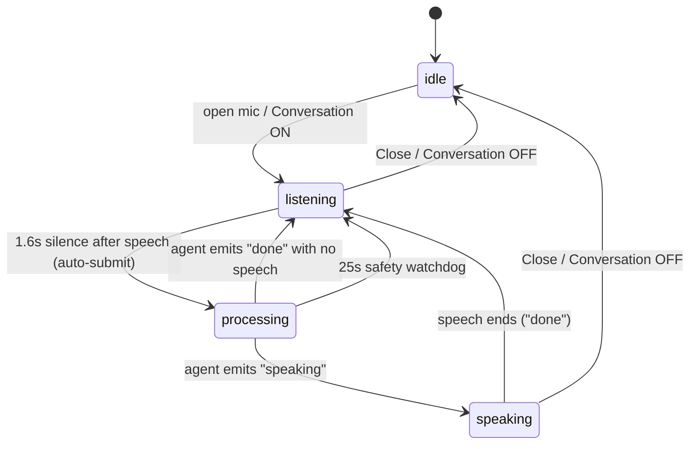

# Satyam — Voice v2: two-language lock + hands-free conversation agent (hardened)

> Verified against the current build (`Satyam_Ai-main.zip`). All voice logic lives in **`frontend/src/components/Shell.tsx`**; chat streaming + speaking lives in **`frontend/src/routes/console.tsx`**. Copy each block into the **Find / Replace** anchor shown. Line numbers are from the current files for orientation only — match on the code text.
>
> **This v2 fixes 3 real bugs found while tracing the v1 design:**
> 1. `closePanel()` (Shell `~L183`) runs `setListening(false)` in **every** branch → in a hands-free loop it would close the dialog after the first turn. Fixed so conversation mode keeps the dialog open and only pauses the mic.
> 2. Console `~L337` `if (!blocked) speak(...)` → a blocked/RBAC answer never speaks, so the loop would **stall forever**. Fixed by always emitting an end-of-turn signal.
> 3. Console `~L263` `connect the dots` branch `return`s before speaking → same stall. Fixed.
> Plus a timing fix: the data path speaks **only after** streaming completes, so a blind “no-speech” timer would re-open the mic mid-answer (echo). v2 uses an explicit **`thinking → speaking → done`** protocol so the mic re-opens **only** when the agent is truly finished.

---

## Architecture — turn-taking state machine

One controller in `Shell.tsx` owns a single `phaseRef`. The mic is **only** live in `listening`; it is muted the entire time the agent is working or talking (no echo/feedback).



**Signal protocol (single event `satyam:ai-state`, `detail.state`):**

| state | emitted by | controller action |
|---|---|---|
| `thinking` | Console at start of a **voice** turn | keep mic muted; arm 25s safety watchdog |
| `speaking` | Console/Shell when TTS actually starts | show “Speaking…”; clear watchdog |
| `done` | Console/Shell when TTS ends, is skipped, blocked, or errors | re-open the mic for the next turn |

Shell-only turns (navigation / language switch) speak via `speakText`, which sets `isSpeaking`; the speech-end poll calls the same `resumeListening()`. A pure screen+task turn (no speech) re-opens the mic on a short post-navigation timer. **Every** terminal path therefore funnels into exactly one `resumeListening()`, which is idempotent.

---

# Issue 1 — Lock all voice/speech to English (India) + Kannada only

### 1.1 Replace the 8-language dropdown (`Shell.tsx`, the “Speech output” `<select>`)

**Find:**

```tsx
                <select
                  value={voiceLang}
                  onChange={(e) => setVoiceLang(e.target.value)}
                  className="flex-1 rounded-[5px] border-2 border-foreground bg-background px-2 py-1 text-xs text-foreground outline-none"
                >
                  <option value="en-IN">English (India)</option>
                  <option value="en-US">English (US)</option>
                  <option value="en-GB">English (UK)</option>
                  <option value="kn-IN">Kannada (ಕನ್ನಡ)</option>
                  <option value="hi-IN">Hindi (हिन्दी)</option>
                  <option value="ta-IN">Tamil (தமிழ்)</option>
                  <option value="te-IN">Telugu (తెలుగు)</option>
                  <option value="ml-IN">Malayalam (മലയാളം)</option>
                </select>
```

**Replace with:**

```tsx
                <select
                  value={voiceLang}
                  onChange={(e) => setVoiceLang(coerceVoiceLang(e.target.value))}
                  className="flex-1 rounded-[5px] border-2 border-foreground bg-background px-2 py-1 text-xs text-foreground outline-none"
                >
                  <option value="en-IN">English (India)</option>
                  <option value="kn-IN">Kannada (ಕನ್ನಡ)</option>
                </select>
```

### 1.2 Sanitize stored `voiceLang` (an old `en-US` etc. must not leak back)

**Find** the `voiceLang` initializer:

```tsx
  const [voiceLang, setVoiceLang] = useState(() => {
    try {
      const saved = localStorage.getItem("satyam-voice-lang");
      if (saved) return saved;
    } catch {}
    return lang === "KN" ? "kn-IN" : "en-IN";
  });
```

**Replace with:**

```tsx
  // The only two supported voice locales, app-wide.
  const VOICE_LANGS = ["en-IN", "kn-IN"] as const;
  const coerceVoiceLang = (v: string | null | undefined): string => {
    if (v && (VOICE_LANGS as readonly string[]).includes(v)) return v;
    if (v && v.toLowerCase().startsWith("kn")) return "kn-IN";
    return "en-IN";
  };
  const [voiceLang, setVoiceLang] = useState<string>(() => {
    try { return coerceVoiceLang(localStorage.getItem("satyam-voice-lang")); } catch {}
    return lang === "KN" ? "kn-IN" : "en-IN";
  });
```

### 1.3 Collapse the command-handler locale to the two supported values

**Find** (inside `handle(...)`):

```tsx
      const speechLang =
        resolved === "kn"
          ? "kn-IN"
          : detail.lang && !detail.lang.toLowerCase().startsWith("kn")
            ? detail.lang
            : "en-IN";
```

**Replace with:**

```tsx
      const speechLang = resolved === "kn" ? "kn-IN" : "en-IN";
```

> Everything else already keys off `lang === "KN" ? "kn-IN" : "en-IN"` (recognition `rec.lang`, the dialog header, the EN | ಕನ್ನಡ toggle) and `lib/i18n.tsx` is already `Lang = "EN" | "KN"`. No other language UI exists.

---

# Issue 2 — Hands-free two-way conversation agent

### 2.0 Imports

In `Shell.tsx`, **add `useCallback`** to the React import:

```tsx
import { type ReactNode, useState, useEffect, useRef, useCallback } from "react";
```

### 2.1 State + refs (add inside `Shell()`, right after the `recognitionRef` declaration)

```tsx
  const [conversationMode, setConversationMode] = useState(false);

  // —— turn-taking machine ——
  const phaseRef = useRef<"listening" | "processing" | "speaking">("listening");
  const conversationModeRef = useRef(false);
  const listeningRef = useRef(false);
  const voiceLangRef = useRef(voiceLang);
  const speechRateRef = useRef(speechRate);
  const liveFinalRef = useRef("");      // finalized speech this turn
  const liveInterimRef = useRef("");    // latest interim words
  const turnSubmittedRef = useRef(false);
  const silenceTimerRef = useRef<ReturnType<typeof setTimeout> | null>(null);
  const thinkWatchdogRef = useRef<ReturnType<typeof setTimeout> | null>(null);

  useEffect(() => { conversationModeRef.current = conversationMode; }, [conversationMode]);
  useEffect(() => { listeningRef.current = listening; }, [listening]);
  useEffect(() => { voiceLangRef.current = voiceLang; }, [voiceLang]);
  useEffect(() => { speechRateRef.current = speechRate; }, [speechRate]);
```

### 2.2 The controller helpers (add right after the refs above)

```tsx
  const clearSilenceTimer = useCallback(() => {
    if (silenceTimerRef.current) { clearTimeout(silenceTimerRef.current); silenceTimerRef.current = null; }
  }, []);
  const clearThinkWatchdog = useCallback(() => {
    if (thinkWatchdogRef.current) { clearTimeout(thinkWatchdogRef.current); thinkWatchdogRef.current = null; }
  }, []);

  // Re-open the mic for the user's next turn. Idempotent and self-gating.
  const resumeListening = useCallback(() => {
    clearThinkWatchdog();
    if (!conversationModeRef.current || !listeningRef.current) return;
    phaseRef.current = "listening";
    setIsSpeaking(false);
    setIsPaused(false);
    setMicActive(true); // re-runs the recognition effect (fresh transcript)
  }, [clearThinkWatchdog]);

  // Stop fully (Close / Conversation OFF).
  const stopConversation = useCallback(() => {
    clearSilenceTimer();
    clearThinkWatchdog();
    phaseRef.current = "listening";
    if (typeof window !== "undefined" && "speechSynthesis" in window) window.speechSynthesis.cancel();
  }, [clearSilenceTimer, clearThinkWatchdog]);
```

### 2.3 Recognition effect — silence-based auto-submit (full replace)

**Find** the effect that begins `if (!listening || !micActive) return;` and creates `const rec = new SR();`, and **replace the entire effect** with:

```tsx
  useEffect(() => {
    if (!listening || !micActive) return;
    setFinalTranscript("");
    setInterimTranscript("");
    setEditableTranscript("");
    setSpeechError(null);
    setSaved(false);
    liveFinalRef.current = "";
    liveInterimRef.current = "";
    turnSubmittedRef.current = false;
    phaseRef.current = "listening";

    const SR: any =
      (typeof window !== "undefined" &&
        ((window as any).SpeechRecognition || (window as any).webkitSpeechRecognition)) ||
      null;
    if (!SR) {
      setSpeechError("Speech recognition is not supported in this browser.");
      return;
    }

    const rec = new SR();
    rec.continuous = true;
    rec.interimResults = true;
    rec.lang = lang === "KN" ? "kn-IN" : "en-IN";

    // Auto-submit one turn ~1.6s after the user stops speaking (conversation mode only).
    const submitTurn = () => {
      if (turnSubmittedRef.current) return;
      const text = `${liveFinalRef.current} ${liveInterimRef.current}`.trim();
      if (!text) return;
      turnSubmittedRef.current = true;
      clearSilenceTimer();
      phaseRef.current = "processing";
      setMicActive(false); // mute the mic while the agent works/talks
      window.dispatchEvent(
        new CustomEvent("satyam:voice-command", {
          detail: { text, lang: voiceLangRef.current, rate: speechRateRef.current, speak: true },
        }),
      );
    };
    const armSilence = () => {
      if (!conversationModeRef.current || turnSubmittedRef.current) return;
      clearSilenceTimer();
      silenceTimerRef.current = setTimeout(submitTurn, 1600);
    };

    rec.onresult = (e: any) => {
      let interim = "";
      let finals = "";
      for (let i = e.resultIndex; i < e.results.length; i++) {
        const res = e.results[i];
        if (res.isFinal) finals += res[0].transcript;
        else interim += res[0].transcript;
      }
      if (finals) {
        const add = finals.trim();
        setFinalTranscript((prev) => (prev ? prev + " " : "") + add);
        setEditableTranscript((prev) => {
          const next = (prev ? prev + " " : "") + add;
          liveFinalRef.current = next;
          return next;
        });
      }
      liveInterimRef.current = interim;
      setInterimTranscript(interim);
      armSilence(); // any speech (interim or final) resets the pause clock
    };
    rec.onerror = (e: any) => {
      if (e.error === "not-allowed" || e.error === "service-not-allowed") {
        setSpeechError("Microphone permission denied.");
      } else if (e.error === "no-speech") {
        // ignore
      } else {
        setSpeechError(`Mic error: ${e.error}`);
      }
    };
    rec.onend = () => {
      if (recognitionRef.current === rec) {
        try { rec.start(); } catch {}
      }
    };

    recognitionRef.current = rec;
    try { rec.start(); } catch {}

    return () => {
      recognitionRef.current = null;
      clearSilenceTimer();
      try { rec.onend = null; rec.stop(); } catch {}
    };
  }, [listening, micActive, lang, clearSilenceTimer]);
```

> Note: `voiceLang`/`speechRate`/`conversationMode` are read through **refs**, so dragging the rate slider or flipping the toggle does **not** restart recognition mid-sentence. The mic is recreated (and the transcript reset) only on open and on each new turn.

### 2.4 Keep manual edits in sync with the submit buffer

**Find** the transcript `<textarea>`’s `onChange`:

```tsx
                  onChange={(e) => {
                    const val = e.target.value;
                    // If user deletes into interim portion, just accept the edit
                    setEditableTranscript(val);
                    // Update finalTranscript so future speech appends correctly
                    setFinalTranscript(val);
                    setInterimTranscript("");
                  }}
```

**Replace with** (so an edited transcript is what gets auto-submitted):

```tsx
                  onChange={(e) => {
                    const val = e.target.value;
                    setEditableTranscript(val);
                    setFinalTranscript(val);
                    setInterimTranscript("");
                    liveFinalRef.current = val;
                    liveInterimRef.current = "";
                  }}
```

### 2.5 Speech-end poll — resume the mic (full replace)

**Find:**

```tsx
  useEffect(() => {
    if (!isSpeaking) return;
    const id = setInterval(() => {
      if (typeof window !== "undefined" && "speechSynthesis" in window) {
        if (!window.speechSynthesis.speaking && !window.speechSynthesis.pending) {
          setIsSpeaking(false);
          setIsPaused(false);
        }
      }
    }, 300);
    return () => clearInterval(id);
  }, [isSpeaking]);
```

**Replace with:**

```tsx
  useEffect(() => {
    if (!isSpeaking) return;
    const id = setInterval(() => {
      if (typeof window !== "undefined" && "speechSynthesis" in window) {
        if (!window.speechSynthesis.speaking && !window.speechSynthesis.pending) {
          setIsSpeaking(false);
          setIsPaused(false);
          resumeListening(); // hands-free: listen for the next reply
        }
      }
    }, 300);
    return () => clearInterval(id);
  }, [isSpeaking, resumeListening]);
```

### 2.6 The agent-state listener (add as a new effect in `Shell()`)

```tsx
  // Single source of truth for the agent's turn lifecycle. Console (and Shell's
  // own confirmations) drive: thinking → speaking → done.
  useEffect(() => {
    const onState = (e: Event) => {
      const state = (e as CustomEvent).detail?.state;
      if (state === "thinking") {
        phaseRef.current = "processing";
        clearThinkWatchdog();
        // Safety net: if the backend never responds, recover the conversation.
        thinkWatchdogRef.current = setTimeout(() => resumeListening(), 25000);
      } else if (state === "speaking") {
        phaseRef.current = "speaking";
        clearThinkWatchdog();
        setIsSpeaking(true);
        setIsPaused(false);
      } else if (state === "done") {
        clearThinkWatchdog();
        setIsSpeaking(false);
        setIsPaused(false);
        resumeListening();
      }
    };
    window.addEventListener("satyam:ai-state", onState);
    return () => window.removeEventListener("satyam:ai-state", onState);
  }, [resumeListening, clearThinkWatchdog]);
```

### 2.7 Fix `closePanel()` + resume after a no-speech navigation turn

**Find** (inside `handle(...)`):

```tsx
      const closePanel = () => {
        setListening(false);
        setMicActive(false);
      };
```

**Replace with** (BUG 1 fix — keep the dialog open during a conversation, just pause the mic):

```tsx
      const closePanel = () => {
        if (conversationModeRef.current) { setMicActive(false); return; }
        setListening(false);
        setMicActive(false);
      };
```

Then **find** the screen+task branch:

```tsx
      // 2) Screen + task (non-console): open it and let the screen run the task.
      if (cmd.route && cmd.route !== "/console") {
        navigate({ to: cmd.route });
        window.dispatchEvent(
          new CustomEvent("satyam:run-task", {
            detail: { route: cmd.route, query: cmd.query, task: cmd.task, lang: resolved, rate, speak: !!detail.speak },
          }),
        );
        closePanel();
        return;
      }
```

**Replace with** (this path produces no spoken reply, so re-open the mic after the route settles):

```tsx
      if (cmd.route && cmd.route !== "/console") {
        navigate({ to: cmd.route });
        window.dispatchEvent(
          new CustomEvent("satyam:run-task", {
            detail: { route: cmd.route, query: cmd.query, task: cmd.task, lang: resolved, rate, speak: !!detail.speak },
          }),
        );
        closePanel();
        if (conversationModeRef.current) setTimeout(() => resumeListening(), 700);
        return;
      }
```

Finally, add `resumeListening` to the dependency array of the effect that defines `handle` (the `satyam:voice-command` listener effect). Its deps become:

```tsx
  }, [pathname, lang, voiceLang, speechRate, navigate, setLang, t, resumeListening]);
```

> The language-switch (`langOnly`) and pure-navigation (`navOnly`) branches already call `speakText(...)`, which sets `isSpeaking` → the 2.5 poll re-opens the mic. No change needed there.

### 2.8 Conversation toggle + dynamic subtitle (dialog UI)

**Find:**

```tsx
              <div className="mt-1 text-xs text-muted-foreground">
                {isSpeaking ? t("Tap Pause to pause, Stop to end.") : t("Speak now. Tap anywhere to stop.")}
              </div>
```

**Replace with:**

```tsx
              <div className="mt-1 text-xs text-muted-foreground">
                {conversationMode
                  ? phaseRef.current === "processing"
                    ? t("Thinking…")
                    : isSpeaking
                      ? t("Speaking… (mic paused)")
                      : t("Conversation mode · just talk, the agent replies and listens again.")
                  : isSpeaking
                    ? t("Tap Pause to pause, Stop to end.")
                    : t("Speak now. Tap anywhere to stop.")}
              </div>
              <button
                type="button"
                onClick={() => {
                  const SRsupported =
                    typeof window !== "undefined" &&
                    ((window as any).SpeechRecognition || (window as any).webkitSpeechRecognition);
                  if (!SRsupported) {
                    setSpeechError("Speech recognition is not supported in this browser.");
                    return;
                  }
                  setConversationMode((on) => {
                    const next = !on;
                    if (next) {
                      phaseRef.current = "listening";
                      setIsSpeaking(false);
                      setIsPaused(false);
                      setMicActive(true);
                    } else {
                      stopConversation();
                    }
                    return next;
                  });
                }}
                className={`mt-3 inline-flex items-center gap-1.5 rounded-[5px] border-2 border-foreground px-3 py-1.5 text-[11px] font-bold uppercase tracking-wide nb-shadow-sm transition ${
                  conversationMode ? "bg-primary text-primary-foreground" : "bg-secondary-background text-foreground"
                }`}
              >
                <Volume2 className="h-3.5 w-3.5" />
                {conversationMode ? t("Conversation: ON") : t("Start conversation")}
              </button>
```

### 2.9 Reset the loop on every close path

There are **two** close handlers (the overlay `onClick` near `~L380` and the bottom “Close” button near `~L596`) plus the “Send to chat” button (`~L543`). In the **overlay** and **Close button** handlers, **find** the existing close body, e.g.:

```tsx
            setListening(false);
            setMicActive(false);
            setIsSpeaking(false);
            setIsPaused(false);
            if (typeof window !== "undefined" && "speechSynthesis" in window) {
              window.speechSynthesis.cancel();
            }
```

**Replace with** (add the two lines):

```tsx
            setListening(false);
            setMicActive(false);
            setIsSpeaking(false);
            setIsPaused(false);
            setConversationMode(false);
            stopConversation();
            if (typeof window !== "undefined" && "speechSynthesis" in window) {
              window.speechSynthesis.cancel();
            }
```

> `stopConversation()` already cancels synthesis; the extra `cancel()` is harmless. Do **not** add this to the “Send to chat” button — that one intentionally only does `setListening(false)`.

---

# Issue 2 (cont.) — Console: drive the turn protocol

### 2.10 Rewrite `speak()` to emit `satyam:ai-state` (full replace)

**Find:**

```tsx
  function speak(text: string, opts?: { speak?: boolean; lang?: string; rate?: number }) {
    if (opts?.speak && typeof window !== "undefined" && "speechSynthesis" in window) {
      try {
        window.speechSynthesis.cancel();
        const utter = new SpeechSynthesisUtterance(text);
        utter.lang = opts?.lang || "en-IN";
        utter.rate = opts?.rate ?? 1;
        window.speechSynthesis.speak(utter);
      } catch {}
    }
  }
```

**Replace with:**

```tsx
  function speak(text: string, opts?: { speak?: boolean; lang?: string; rate?: number }) {
    const emit = (state: "speaking" | "done") =>
      window.dispatchEvent(new CustomEvent("satyam:ai-state", { detail: { state } }));
    // Only voice turns participate in the conversation loop.
    if (!opts?.speak) return;
    if (typeof window === "undefined" || !("speechSynthesis" in window) || !text.trim()) {
      emit("done"); // nothing to say — hand the turn back so the mic re-opens
      return;
    }
    try {
      window.speechSynthesis.cancel();
      const utter = new SpeechSynthesisUtterance(text);
      utter.lang = (opts?.lang || "").toLowerCase().startsWith("kn") ? "kn-IN" : "en-IN";
      utter.rate = opts?.rate ?? 1;
      utter.onstart = () => emit("speaking");
      utter.onend = () => emit("done");
      utter.onerror = () => emit("done");
      window.speechSynthesis.speak(utter);
    } catch {
      emit("done");
    }
  }
```

### 2.11 `sendMessage()` — announce `thinking`, always finish the turn, fix connect-the-dots

**Find** the start of `sendMessage` and its connect-the-dots branch:

```tsx
  async function sendMessage(text: string, opts?: { speak?: boolean; lang?: string; rate?: number }) {
    const trimmed = text.trim();
    if (!trimmed) return;

    const m = trimmed.toLowerCase();
    if (m.includes("connect the dots") || m.includes("ಚುಕ್ಕಿಗಳನ್ನು ಸಂಪರ್ಕ")) {
      const who = (trimmed.match(/(?:for|of|about|against|by)\s+(.+)$/i)?.[1] || "").trim();
      await connectDots(who);
      return;
    }
```

**Replace with** (BUG 2 + BUG 3 fix — emit `thinking` up front; speak a confirmation after connect-the-dots so the loop continues):

```tsx
  async function sendMessage(text: string, opts?: { speak?: boolean; lang?: string; rate?: number }) {
    const trimmed = text.trim();
    if (!trimmed) return;

    const isVoiceTurn = !!opts?.speak;
    const speechLang = (opts?.lang || "").toLowerCase().startsWith("kn") ? "kn-IN" : "en-IN";
    if (isVoiceTurn) {
      window.dispatchEvent(new CustomEvent("satyam:ai-state", { detail: { state: "thinking" } }));
    }

    const m = trimmed.toLowerCase();
    if (m.includes("connect the dots") || m.includes("ಚುಕ್ಕಿಗಳನ್ನು ಸಂಪರ್ಕ")) {
      const who = (trimmed.match(/(?:for|of|about|against|by)\s+(.+)$/i)?.[1] || "").trim();
      await connectDots(who);
      if (isVoiceTurn) {
        speak(
          speechLang === "kn-IN"
            ? `${who || "ಅಪರಾಧಿ"} ಗಾಗಿ ಚುಕ್ಕಿಗಳನ್ನು ಸಂಪರ್ಕಿಸಲಾಗುತ್ತಿದೆ`
            : `Connecting the dots for ${who || "the offender"}.`,
          { speak: true, lang: speechLang, rate: opts?.rate },
        );
      }
      return;
    }
```

Then **find** the final speak call:

```tsx
    if (!blocked) speak(finalAi.text, opts);
```

**Replace with** (BUG 2 fix — always close the voice turn, even when blocked):

```tsx
    speak(finalAi.text, opts);
```

> Why this is safe: `speak()` now no-ops for typed turns (`opts.speak` falsy) and, for voice turns, **always** emits a terminal `done` (after speaking, or immediately if there’s nothing/synthesis is unavailable). A blocked answer is now spoken (the user hears the RBAC notice) and the loop continues. The `cannedFallback()` path already calls `speak(aiText, opts)`, so backend errors also emit `done`.

> No change is needed to the `satyam:voice-send` / `satyam:pending-voice` consumers — both call `sendMessage(..., { speak: true, ... })`, so both now emit the full `thinking → speaking → done` sequence.

---

## Edge cases — and how this design handles each

| Scenario | Handling |
|---|---|
| Dialog closes after turn 1 | **Fixed:** `closePanel()` keeps `listening` true in conversation mode. |
| Blocked / RBAC answer | **Fixed:** always `speak()` → emits `done` → mic re-opens. |
| “Connect the dots” voice turn | **Fixed:** speaks a confirmation → emits `done`. |
| Slow backend (answer > 1.6s) | Mic stays muted through `thinking`; only re-opens on `done`. No premature listen. |
| Backend never responds | 25s `thinkWatchdog` recovers the conversation. |
| Agent’s voice re-entering the mic (echo) | Mic is `setMicActive(false)` for the entire `processing` + `speaking` window. |
| Double submit on a single pause | `turnSubmittedRef` guard + `clearSilenceTimer()` on submit. |
| User edits the transcript before the pause | `onChange` writes `liveFinalRef`, so the edited text is what submits. |
| Rate slider / toggle during a turn | Read via refs → recognition does **not** restart mid-sentence. |
| Navigation turn (no speech) | `setTimeout(resumeListening, 700)` after the route settles. |
| Browser without SpeechRecognition | Toggle refuses to enable and shows the error. |
| Browser without speechSynthesis | `speak()` emits `done` immediately → loop still advances (no TTS). |
| Manual (non-conversation) mode | Every new path is gated by `conversationModeRef`; original behavior is unchanged. |
| Close / toggle OFF mid-speech | `stopConversation()` clears both timers and cancels synthesis. |

---

## Verify

1. `cd frontend && npm run build` — compiles clean.
2. Mic dialog → **Speech output** lists only **English (India)** + **Kannada**; an old stored `en-US` is coerced to `en-IN`.
3. Tap **Start conversation**, say “Top crime types in Mysuru City.” → after the pause it auto-sends, the agent **speaks** the answer, then the mic re-opens — no taps.
4. Mid-call say “open the network screen” → navigates, says “Opening Network”, keeps listening.
5. Mid-call say “connect the dots for S. Manjunath” → runs the trail, speaks a confirmation, keeps listening.
6. Ask something your role can’t see → hears the RBAC notice, **conversation still continues** (regression check for BUG 2).
7. Switch app to Kannada (EN | ಕನ್ನಡ) → recognition uses `kn-IN`, replies spoken in `kn-IN`.
8. While the agent speaks, confirm the mic is paused (no self-echo); it resumes only after speech ends.
9. Tap **Close** / outside / **Conversation: ON** again → loop stops cleanly (both timers cleared, synthesis cancelled).
10. Pull the network cable, ask a question → within 25s the mic re-opens (watchdog), no permanent stall.
