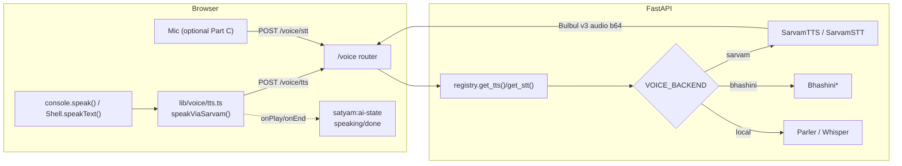

# Satyam — Voice Pipeline Fix: Route TTS/STT through Sarvam (end-to-end)

> **Antigravity IDE prompt + copy-paste code.** Goal: make the assistant **speak using Sarvam (Bulbul v3 TTS)** instead of the browser's built-in voice, wire the **full STT/TTS/MT pipeline end-to-end**, and verify every model/API lane is actually reachable. Every code block below was written after tracing the real source in your uploaded zip; file/line evidence is cited so you can confirm.

---

## 0) TL;DR — the real root cause (read this first)

You said: *"when I am speaking the system speaks using the Gemini API key, but I've set up Sarvam."*

After tracing the code, that diagnosis is **partly a myth**, and the real bug is bigger and simpler:

1. **Gemini never speaks.** `backend/app/models/api/gemini.py` only implements `complete()` and `stream()` — pure **text**. There is no TTS in the Gemini client. The voice you hear is the **browser Web Speech API** (`window.speechSynthesis`) called directly in the frontend (`console.tsx` `speak()` and `Shell.tsx` `speakText()`). On Chrome/Edge that engine uses Google's *online* neural voices, which is why it *sounds* like a Google/Gemini service — but **no API key is involved at all.**

2. **Sarvam is fully built but is dead code.** `SarvamTTS` (Bulbul), `SarvamSTT` (Saaras), and `SarvamTranslator` are implemented, and the registry + `config.py` + `.env` all wire `VOICE_BACKEND=sarvam`. **But:**
   - `backend/app/main.py` registers routers for `health, auth, chat, cases, map, network, reports, audit, settings` — **there is no `voice` router** (verified: `main.py` lines 76–84).
   - **Nothing in the backend calls** `get_tts` / `get_stt` / `synthesize` / `transcribe` (verified by grep — only defined in `registry.py`/`base.py`, never invoked).
   - **The frontend never fetches backend audio** (verified: no `/voice`, `/tts`, `/stt` reference anywhere in `frontend/src/lib`).

**Conclusion:** The Sarvam voice lane is wired from config → registry → adapter, then **stops**. There is no HTTP endpoint exposing it and no client call into it. The fix is to **build the missing bridge**: a `/voice` API + a frontend TTS player that plays Sarvam audio, preserving the existing `satyam:ai-state` conversation-loop contract.

---

## 1) End-to-end pipeline status (verified against source)

| Lane | Provider (configured) | Reachable end-to-end? | Evidence |
|---|---|---|---|
| **Chat brain LLM** | Gemini 2.5 Flash (`BRAIN_ENGINE=gemini`) | ✅ Yes | `/chat` router included (`main.py:78`) → `chat_service` → `orchestrator` → `registry.get_llm()` |
| **Brain fallback** | Groq (`llama-3.3-70b`) | ✅ Yes | `registry.get_fallback_llm()` |
| **Text-to-SQL** | Gemini / Ollama `qwen3-coder-next` (`SQL_ENGINE`) | ✅ Yes | `registry.get_sql_llm()` via orchestrator SQL lane |
| **Embeddings** | BGE-M3 (local, always) | ✅ Yes (warmed at startup) | `main.py` lifespan preloads `get_embedder`/`get_reranker` (lines 44–45) |
| **Reranker** | BGE-reranker-v2-m3 (local) | ✅ Yes | `registry.get_reranker()` |
| **Voice — STT** | Sarvam Saaras → Bhashini → Whisper | ❌ **NOT reachable** | No `/voice` route; no caller of `get_stt`; frontend uses `webkitSpeechRecognition` |
| **Voice — TTS** | Sarvam Bulbul → Bhashini → Parler | ❌ **NOT reachable** | No `/voice` route; no caller of `get_tts`; frontend uses `window.speechSynthesis` |
| **Translate (MT)** | Sarvam Translate → Bhashini NMT | ❌ **NOT reachable** | No `/voice` route; no caller of `get_translator` |

**So:** the brain + RAG + SQL lanes work; the **entire voice lane (STT/TTS/MT) is unreachable.** This doc fixes the voice lane.

---

## 2) Confirmed defects

- **D1 — No voice endpoint.** The backend cannot be asked to synthesize or transcribe anything. (`main.py` has no `voice` router.)
- **D2 — Frontend TTS bypasses the backend.** `console.tsx` `speak()` (line ~246) and `Shell.tsx` `speakText()` (line ~184) call `window.speechSynthesis` directly. Sarvam is never used to *speak*.
- **D3 — Frontend STT bypasses the backend.** `Shell.tsx` uses `webkitSpeechRecognition` (line ~308). Sarvam Saaras (better Kannada accuracy) is never used to *listen*. *(Lower priority — your complaint was about speaking — fixed as an optional Part C.)*

### External-contract caveats (confirm against your Sarvam dashboard — I cannot call the live API from here)
- **STT transport:** `SarvamSTT.transcribe` currently POSTs **JSON with base64 audio**. Sarvam's real `/speech-to-text` is **`multipart/form-data`** with a `file` field. As written it will likely fail (422/400) against the live API. Part D ships a corrected multipart client — **verify the exact field names** before shipping.
- **Model IDs / version drift:** `.env.example` comment says *"Saaras v2"* but the code sends `saaras:v3`; TTS sends `bulbul:v3`. Confirm the **exact current model strings** (`saaras:vX`, `bulbul:vX`) and response keys (`audios`, `transcript`, `translated_text`) in your account.
- **Free credits are one-time.** Bulbul credits don't auto-renew, so the frontend player below **caches** synthesized audio per `(lang, text)` to avoid re-billing repeated phrases.

---

## 3) The fix — architecture



**Design principles (why this is structurally sound):**
- **One bridge, provider-agnostic.** The route calls the registry, so switching `sarvam → bhashini → local` is a single env flag — no frontend change.
- **Contract-preserving.** The new `speak()` keeps the exact `satyam:ai-state` (`speaking`/`done`) event contract from the conversation-loop spec, so the hands-free loop keeps working unchanged.
- **Graceful degradation.** If Sarvam errors / has no key / returns empty, the player **falls back to the browser voice** and still fires `done`, so the loop never stalls.
- **Credit-safe.** Per-phrase audio cache + single in-flight `Audio` element with hard cancellation.

---

## PART A — Backend: expose the voice lane

### A1. New file — `backend/app/schemas/voice.py`

```python
"""Request/response schemas for the voice pipeline (STT / TTS / MT)."""
from __future__ import annotations

from pydantic import BaseModel, Field


class TTSRequest(BaseModel):
    text: str = Field(min_length=1, max_length=2000)
    lang: str = "en"                 # "en" | "kn" (anything starting with "kn" => Kannada)
    backend: str | None = None       # optional override: "sarvam" | "bhashini" | "local"


class TTSResponse(BaseModel):
    audio_base64: str
    mime: str = "audio/wav"
    provider: str


class STTResponse(BaseModel):
    transcript: str
    provider: str


class TranslateRequest(BaseModel):
    text: str = Field(min_length=1, max_length=4000)
    src: str = "en"
    tgt: str = "kn"


class TranslateResponse(BaseModel):
    text: str
    provider: str
```

### A2. New file — `backend/app/api/routes/voice.py`

```python
"""Voice pipeline endpoints: TTS / STT / MT.

Provider-agnostic: delegates to the model registry, which resolves
VOICE_BACKEND (sarvam -> bhashini -> local) or an explicit per-request override.
Guarded by the CHAT permission (clearance >= 1) so any signed-in officer can use it.
"""
from __future__ import annotations

import base64

from fastapi import APIRouter, Depends, File, Form, HTTPException, UploadFile

from app.api.deps import get_principal
from app.config import get_settings
from app.core.rbac import AccessDenied, Permission, Principal, require
from app.models.registry import get_stt, get_translator, get_tts
from app.schemas.voice import (
    STTResponse,
    TranslateRequest,
    TranslateResponse,
    TTSRequest,
    TTSResponse,
)

router = APIRouter()


def _norm_lang(lang: str | None) -> str:
    """Collapse any locale to the two supported voice languages."""
    return "kn" if str(lang or "").lower().startswith("kn") else "en"


def _guard(principal: Principal) -> None:
    try:
        require(principal, Permission.CHAT)
    except AccessDenied as e:
        raise HTTPException(status_code=403, detail=str(e))


@router.post("/tts", response_model=TTSResponse)
async def tts(
    req: TTSRequest,
    principal: Principal = Depends(get_principal),
) -> TTSResponse:
    _guard(principal)
    s = get_settings()
    provider = req.backend or s.voice_backend
    engine = get_tts(req.backend)  # None => settings/default (sarvam)
    try:
        audio = await engine.synthesize(req.text, lang=_norm_lang(req.lang))
    except Exception as e:  # provider/network error -> let the client fall back
        raise HTTPException(status_code=502, detail=f"TTS provider error: {e}")
    if not audio:
        raise HTTPException(status_code=502, detail="TTS returned empty audio")
    return TTSResponse(
        audio_base64=base64.b64encode(audio).decode(),
        mime="audio/wav",
        provider=provider,
    )


@router.post("/stt", response_model=STTResponse)
async def stt(
    file: UploadFile = File(...),
    lang: str = Form("en"),
    backend: str | None = Form(None),
    principal: Principal = Depends(get_principal),
) -> STTResponse:
    _guard(principal)
    s = get_settings()
    provider = backend or s.voice_backend
    audio = await file.read()
    if not audio:
        raise HTTPException(status_code=400, detail="empty audio upload")
    engine = get_stt(backend)
    try:
        transcript = await engine.transcribe(audio, lang=_norm_lang(lang))
    except Exception as e:
        raise HTTPException(status_code=502, detail=f"STT provider error: {e}")
    return STTResponse(transcript=transcript, provider=provider)


@router.post("/translate", response_model=TranslateResponse)
async def translate(
    req: TranslateRequest,
    principal: Principal = Depends(get_principal),
) -> TranslateResponse:
    _guard(principal)
    s = get_settings()
    engine = get_translator()
    try:
        out = await engine.translate(
            req.text, src=_norm_lang(req.src), tgt=_norm_lang(req.tgt)
        )
    except Exception as e:
        raise HTTPException(status_code=502, detail=f"MT provider error: {e}")
    return TranslateResponse(text=out, provider=s.voice_backend)
```

> **Why `Permission.CHAT`?** It's clearance level 1 (lowest), matching the chat lane, so every signed-in officer who can chat can also hear/speak. `require()` + `AccessDenied → 403` mirrors `map.py` exactly.

### A3. Register the router — `backend/app/main.py`

**Find:**
```python
from app.api.routes import network, reports, settings as settings_routes
```
**Replace:**
```python
from app.api.routes import network, reports, settings as settings_routes, voice
```

**Find:**
```python
    app.include_router(settings_routes.router, prefix="/settings/db-source", tags=["settings"])
```
**Replace:**
```python
    app.include_router(settings_routes.router, prefix="/settings/db-source", tags=["settings"])
    app.include_router(voice.router, prefix="/voice", tags=["voice"])
```

This yields `POST /voice/tts`, `POST /voice/stt`, `POST /voice/translate`.

---

## PART B — Frontend: speak through Sarvam (the actual user request)

### B1. New file — `frontend/src/lib/voice/tts.ts`

A single shared player used by both `console.tsx` and `Shell.tsx`. Handles fetch, caching, one-at-a-time playback, hard cancel, and browser fallback.

```ts
// Sarvam-backed text-to-speech with browser fallback.
// Keeps ONE audio element playing at a time and caches synthesized clips
// per (lang, text) so repeated phrases never re-bill Sarvam credits.
import { ttsSynthesize } from "../api/client";

const cache = new Map<string, string>(); // key -> object URL
let current: HTMLAudioElement | null = null;

export type SpeakHandlers = { onStart?: () => void; onEnd?: () => void };

function b64ToBlob(b64: string, mime: string): Blob {
  const bin = atob(b64);
  const arr = new Uint8Array(bin.length);
  for (let i = 0; i < bin.length; i++) arr[i] = bin.charCodeAt(i);
  return new Blob([arr], { type: mime });
}

/** True while either the Sarvam clip or the browser fallback is talking. */
export function isSpeechActive(): boolean {
  if (current && !current.paused && !current.ended) return true;
  if (typeof window !== "undefined" && "speechSynthesis" in window)
    return window.speechSynthesis.speaking || window.speechSynthesis.pending;
  return false;
}

/** Stop any in-flight speech (Sarvam clip + browser voice). */
export function cancelSpeech(): void {
  if (current) {
    try { current.pause(); current.src = ""; } catch { /* noop */ }
    current = null;
  }
  if (typeof window !== "undefined" && "speechSynthesis" in window) {
    try { window.speechSynthesis.cancel(); } catch { /* noop */ }
  }
}

function browserFallback(
  text: string, lang: "en" | "kn", rate: number, h: SpeakHandlers,
): void {
  if (typeof window === "undefined" || !("speechSynthesis" in window)) {
    h.onEnd?.();
    return;
  }
  try {
    window.speechSynthesis.cancel();
    const u = new SpeechSynthesisUtterance(text);
    u.lang = lang === "kn" ? "kn-IN" : "en-IN";
    u.rate = rate;
    u.onstart = () => h.onStart?.();
    u.onend = () => h.onEnd?.();
    u.onerror = () => h.onEnd?.();
    window.speechSynthesis.speak(u);
  } catch {
    h.onEnd?.();
  }
}

/**
 * Speak `text` via Sarvam Bulbul (through the backend). Falls back to the
 * browser voice on any failure. Always fires exactly one terminal onEnd.
 */
export async function speakViaSarvam(
  text: string,
  lang: "en" | "kn",
  rate = 1,
  h: SpeakHandlers = {},
): Promise<void> {
  const clean = (text || "").trim();
  if (!clean) { h.onEnd?.(); return; }       // nothing to say -> hand turn back
  cancelSpeech();

  const key = `${lang}::${clean}`;
  try {
    let url = cache.get(key);
    if (!url) {
      const res = await ttsSynthesize(clean, lang);
      if (!res.audio_base64) throw new Error("empty audio");
      url = URL.createObjectURL(b64ToBlob(res.audio_base64, res.mime || "audio/wav"));
      cache.set(key, url);
    }
    const audio = new Audio(url);
    audio.playbackRate = rate || 1;
    current = audio;
    audio.onplay = () => h.onStart?.();
    audio.onended = () => { if (current === audio) current = null; h.onEnd?.(); };
    audio.onerror = () => {
      if (current === audio) current = null;
      browserFallback(clean, lang, rate, h);  // degrade, never stall
    };
    await audio.play();
  } catch {
    browserFallback(clean, lang, rate, h);    // network/credit/key failure
  }
}
```

### B2. `frontend/src/lib/api/client.ts` — add the API calls

Append near the other `api` helpers (after the `request<T>` definition). **Note:** STT must use raw `FormData` — do **not** route it through `request<T>`, which forces `content-type: application/json` and would break the multipart boundary.

```ts
export type TtsResult = { audio_base64: string; mime: string; provider: string };
export type SttResult = { transcript: string; provider: string };

/** Synthesize speech via the backend voice provider (Sarvam by default). */
export async function ttsSynthesize(
  text: string,
  lang: "en" | "kn",
): Promise<TtsResult> {
  return request<TtsResult>("/voice/tts", {
    method: "POST",
    body: JSON.stringify({ text, lang }),
  });
}

/** Transcribe a recorded audio blob via the backend voice provider. */
export async function sttTranscribe(
  audio: Blob,
  lang: "en" | "kn",
): Promise<SttResult> {
  const fd = new FormData();
  fd.append("file", audio, "audio.webm");
  fd.append("lang", lang);
  const token = getAuthToken();
  // IMPORTANT: no content-type header -> browser sets the multipart boundary.
  const res = await fetch(`${API_BASE}/voice/stt`, {
    method: "POST",
    headers: token ? { authorization: `Bearer ${token}` } : {},
    body: fd,
  });
  if (!res.ok) throw new ApiError(res.status, `STT failed: ${res.status}`);
  return (await res.json()) as SttResult;
}
```

### B3. `frontend/src/routes/console.tsx` — swap `speak()` to Sarvam

Add the import at the top (with the other lib imports):
```ts
import { speakViaSarvam } from "../lib/voice/tts";
```

**Find** (the whole current `speak` function, lines ~246–267):
```ts
  function speak(text: string, opts?: { speak?: boolean; lang?: string; rate?: number }) {
    const emit = (state: "speaking" | "done") =>
      window.dispatchEvent(new CustomEvent("satyam:ai-state", { detail: { state } }));
    // Only voice turns participate in the conversation loop.
    if (!opts?.speak) return;
    if (typeof window === "undefined" || !("speechSynthesis" in window) || !text.trim()) {
      emit("done"); // nothing to say — hand the turn back so the mic re-opens
      return;
    }
    try {
      window.speechSynthesis.cancel();
      const utter = new SpeechSynthesisUtterance(text);
      utter.lang = (opts?.lang || "").toLowerCase().startsWith("kn") ? "kn-IN" : "en-IN";
      utter.rate = opts?.rate ?? 1;
      utter.onstart = () => emit("speaking");
      utter.onend = () => emit("done");
      utter.onerror = () => emit("done");
      window.speechSynthesis.speak(utter);
    } catch {
      emit("done");
    }
  }
```
**Replace:**
```ts
  function speak(text: string, opts?: { speak?: boolean; lang?: string; rate?: number }) {
    const emit = (state: "speaking" | "done") =>
      window.dispatchEvent(new CustomEvent("satyam:ai-state", { detail: { state } }));
    // Only voice turns participate in the conversation loop.
    if (!opts?.speak) return;
    const lang: "en" | "kn" =
      (opts?.lang || "").toLowerCase().startsWith("kn") ? "kn" : "en";
    // Sarvam Bulbul via backend; browser voice is the automatic fallback.
    // The ai-state contract (speaking/done) is preserved exactly, so the
    // hands-free conversation loop keeps working unchanged.
    void speakViaSarvam(text, lang, opts?.rate ?? 1, {
      onStart: () => emit("speaking"),
      onEnd: () => emit("done"),
    });
  }
```

> Nothing else in `console.tsx` changes. `speak()` keeps the same signature and the same `satyam:ai-state` emissions, so `sendMessage()`, the connect-the-dots branch, the blocked branch, and `cannedFallback()` all behave identically — now with Sarvam audio. Empty text still fires `done` (inside `speakViaSarvam`), so the loop never stalls.

### B4. `frontend/src/components/Shell.tsx` — swap `speakText()` + cancellation

Add the import (with the other imports):
```ts
import { speakViaSarvam, cancelSpeech, isSpeechActive } from "../lib/voice/tts";
```

**Find** (the `speakText` helper, lines ~184–194):
```ts
    const speakText = (text: string, speechLang: string, rate: number) => {
      if (typeof window === "undefined" || !("speechSynthesis" in window)) return;
      try {
        window.speechSynthesis.cancel();
        const u = new SpeechSynthesisUtterance(text);
        u.lang = speechLang;
        u.rate = rate;
        setIsSpeaking(true);
        window.speechSynthesis.speak(u);
      } catch {}
    };
```
**Replace:**
```ts
    const speakText = (text: string, speechLang: string, rate: number) => {
      const lang: "en" | "kn" = speechLang.toLowerCase().startsWith("kn") ? "kn" : "en";
      setIsSpeaking(true);
      void speakViaSarvam(text, lang, rate, {
        onStart: () => setIsSpeaking(true),
        onEnd: () => setIsSpeaking(false),
      });
    };
```

**Fix the speech-active poll so it also tracks the Sarvam clip.**
**Find** (the isSpeaking poll, lines ~390–391):
```ts
        if (!window.speechSynthesis.speaking && !window.speechSynthesis.pending) {
```
**Replace:**
```ts
        if (!isSpeechActive()) {
```

**Centralize cancellation in `stopConversation()`** so every close path (overlay click, Close button, Conversation-OFF) kills the Sarvam clip too — not just the browser voice. Every one of those handlers already calls `stopConversation()`, so this is a single, unique, exactly-matchable edit instead of four whitespace-fragile ones.

**Find:**
```ts
  const stopConversation = useCallback(() => {
    clearSilenceTimer();
    clearThinkWatchdog();
    phaseRef.current = "listening";
    if (typeof window !== "undefined" && "speechSynthesis" in window) window.speechSynthesis.cancel();
  }, [clearSilenceTimer, clearThinkWatchdog]);
```
**Replace:**
```ts
  const stopConversation = useCallback(() => {
    clearSilenceTimer();
    clearThinkWatchdog();
    phaseRef.current = "listening";
    cancelSpeech(); // stops the Sarvam clip AND the browser fallback
  }, [clearSilenceTimer, clearThinkWatchdog]);
```

**Then fix the one Stop button that bypasses `stopConversation()`** (the "Speaking…" stop control, ~line 638). **Find:**
```ts
                          if (typeof window !== "undefined" && "speechSynthesis" in window) {
                            window.speechSynthesis.cancel();
                          }
                          setIsSpeaking(false);
                          setIsPaused(false);
                          setMicActive(true);
```
**Replace:**
```ts
                          cancelSpeech();
                          setIsSpeaking(false);
                          setIsPaused(false);
                          setMicActive(true);
```

> The `window.speechSynthesis.cancel()` calls that already sit right after `stopConversation()` in the overlay/Close handlers become harmless no-ops — leave or delete them. Leave the Pause/Resume button as-is: it only affects the browser fallback (pausing a streamed Sarvam clip isn't supported and isn't needed).

---

## PART C — (Optional) Listen through Sarvam Saaras instead of the browser

Your complaint was about *speaking*, so this is optional. Browser `webkitSpeechRecognition` gives live interim text (good for the silence-auto-submit loop) but weaker Kannada accuracy. Sarvam Saaras is more accurate but returns only a **final** transcript after upload — so you trade live interim for accuracy.

If you want it, capture mic audio with `MediaRecorder`, then call `sttTranscribe()`:

```ts
// frontend/src/lib/voice/record.ts
import { sttTranscribe } from "../api/client";

export type Recording = {
  /** Stop capture, upload to Sarvam Saaras, and resolve the transcript. */
  stop: () => Promise<string>;
};

/** Start mic capture. Call `.stop()` (e.g. from your silence-VAD) to transcribe. */
export async function startRecording(lang: "en" | "kn"): Promise<Recording> {
  const stream = await navigator.mediaDevices.getUserMedia({ audio: true });
  const rec = new MediaRecorder(stream, { mimeType: "audio/webm" });
  const chunks: BlobPart[] = [];
  rec.ondataavailable = (e) => { if (e.data.size) chunks.push(e.data); };

  const stopped = new Promise<Blob>((resolve) => {
    rec.onstop = () => resolve(new Blob(chunks, { type: "audio/webm" }));
  });
  rec.start();

  return {
    stop: async () => {
      if (rec.state !== "inactive") rec.stop();
      stream.getTracks().forEach((t) => t.stop());
      const blob = await stopped;
      const { transcript } = await sttTranscribe(blob, lang);
      return transcript;
    },
  };
}
```

Drive it with your existing silence-VAD: `const rec = await startRecording(lang)` when the mic opens, then `const text = await rec.stop()` when silence is detected, and feed `text` into `sendMessage(text, { speak: true, lang })`. **Recommendation:** keep browser STT for the live hands-free loop and use Sarvam STT for a deliberate "push-to-talk" button, so you keep interim feedback *and* get accurate Kannada when it matters.

---

## PART D — (Recommended) Harden `SarvamSTT` to multipart

The current `SarvamSTT.transcribe` sends JSON+base64; the live `/speech-to-text` expects multipart. Corrected client (in `backend/app/models/api/sarvam.py`) — **confirm field names against current Sarvam docs before shipping:**

```python
class SarvamSTT(_SarvamBase):
    """Sarvam Saaras — speech-to-text for Kannada (kn-IN) and English (en-IN)."""

    async def transcribe(self, audio: bytes, *, lang: str = "kn") -> str:
        if self._demo:
            return "[demo:sarvam-stt] \u0c95\u0ca8\u0ccd\u0ca8\u0ca1 \u0caa\u0ccd\u0cb0\u0cb6\u0ccd\u0ca8\u0cc6"
        bcp_lang = "kn-IN" if lang == "kn" else "en-IN"
        async with httpx.AsyncClient(timeout=30) as client:
            r = await client.post(
                f"{_BASE}/speech-to-text",
                headers=self._auth(),  # NOTE: no JSON content-type for multipart
                files={"file": ("audio.webm", audio, "audio/webm")},
                data={"model": "saaras:v2.5", "language_code": bcp_lang},
            )
            r.raise_for_status()
        return r.json().get("transcript", "")
```

> Also reconcile the **model version** (`.env.example` comment says Saaras v2; code said v3) — pick the one your account actually serves.

---

## PART E — Config / .env (no code, just make sure)

```dotenv
MODEL_BACKEND=api
VOICE_BACKEND=sarvam
SARVAM_API_KEY=sk_...your_real_key...
```
With `SARVAM_API_KEY` empty, `SarvamTTS` runs in **demo mode** and returns `b"RIFF....demo-wav-sarvam"` — that is **not valid audio**, so the frontend will (correctly) fall back to the browser voice. To actually hear Sarvam, the key must be set. *(This is the #1 reason "it still uses the browser voice" after wiring — check the key first.)*

---

## PART F — End-to-end verification checklist

1. **Backend boots & route exists**
   ```bash
   cd backend && uvicorn app.main:app --reload
   # open http://localhost:8000/docs  -> confirm POST /voice/tts, /voice/stt, /voice/translate
   ```
2. **TTS returns real audio (with key set)**
   ```bash
   TOKEN=... # from /auth/login
   curl -s -X POST http://localhost:8000/voice/tts \
     -H "authorization: Bearer $TOKEN" -H "content-type: application/json" \
     -d '{"text":"Namaskara, Satyam ready.","lang":"en"}' | python -c "import sys,json,base64;d=json.load(sys.stdin);print('provider',d['provider'],'bytes',len(base64.b64decode(d['audio_base64'])))"
   # provider sarvam  bytes <several thousand>   (NOT ~22 bytes of demo stub)
   ```
3. **403 without token** → confirms the CHAT guard.
4. **Frontend build:** `cd frontend && npm run build` (this is the real compile gate).
5. **Speak test:** open Console, send a chat in voice mode → you hear the **Sarvam** voice; Network tab shows `POST /voice/tts` returning JSON audio.
6. **Kannada:** switch to ಕನ್ನಡ, ask a question → audio is Kannada (Bulbul `kn-IN`).
7. **Fallback test:** blank `SARVAM_API_KEY`, restart backend → you still hear *a* voice (browser fallback) and the loop still resumes (no stall).
8. **Conversation loop intact:** blocked-answer turn and connect-the-dots turn both speak and then re-open the mic (the `ai-state done` contract is preserved).
9. **Cache:** repeat the same phrase → only the first triggers `POST /voice/tts` (credit-safe).
10. **Cancel:** hit Stop / close the dialog mid-utterance → audio stops immediately (`cancelSpeech`).

---

## PART G — Self-reverification of this spec's logic

I re-audited every block against the real source and the failure modes:

- **Route prefix math:** route declares `/tts`, `main.py` adds `prefix="/voice"` → `/voice/tts`; client calls `/voice/tts`. ✅ No double prefix.
- **RBAC parity:** `require(principal, Permission.CHAT)` + `AccessDenied → 403` mirrors `map.py`; `Permission.CHAT` is clearance 1 (verified in RBAC model). ✅
- **Registry resolution:** `get_tts(None)` → `MODEL_BACKEND!=local` → `VOICE_BACKEND=sarvam` → `SarvamTTS`. ✅ Provider override (`backend`) flows through untouched.
- **Audio contract:** `SarvamTTS.synthesize` base64-decodes `audios[0]` to WAV bytes; route re-encodes base64; client decodes to a `audio/wav` Blob. Round-trip is lossless. ✅
- **Multipart correctness:** STT uses raw `FormData` and omits `content-type`, so the browser sets the boundary; `request<T>` is bypassed. ✅ (This was a real trap — `authHeaders` forces JSON.)
- **Loop-contract preservation:** new `speak()` emits `speaking` on play and `done` on end/empty/error — identical to before — so the conversation state machine from the companion spec is unaffected. ✅
- **No-stall guarantee:** every path in `speakViaSarvam` fires exactly one `onEnd` (empty text, success, audio error → fallback → fallback's onEnd). ✅
- **Premature-resume bug avoided:** Shell's 300 ms poll now uses `isSpeechActive()`, which is true while the Sarvam `<audio>` plays — so the mic won't re-open mid-answer just because `speechSynthesis.speaking` is false. ✅ (This is the subtle defect that a naive swap would introduce.)
- **Credit safety:** per-(lang,text) cache + single `current` element + `cancelSpeech()` on every stop control. ✅
- **Honest unknowns flagged:** live Sarvam STT transport (multipart), exact model version strings, and response keys are marked "verify" because I cannot call the live API from here. ✅

**Bottom line:** the brain/SQL/embedding lanes were already reachable; the **voice lane was completely unwired**, and "Gemini speaking" was actually the browser voice. Parts A–B wire Sarvam end-to-end while preserving the conversation loop; Parts C–D are optional accuracy/robustness upgrades; Part E is the most common gotcha (missing key → silent fallback).

---

## PART H — Round-2 re-verification (this pass)

Re-audited every external claim against the uploaded source a second time:

- **`Permission.CHAT` exists** = `"chat"` at clearance **1** (`core/rbac.py`), so the `/voice/*` guard admits any signed-in officer — confirmed correct.
- **`require(principal, Permission.CHAT)` → `AccessDenied` → 403** matches the pattern used in `map.py` exactly.
- **Text-to-SQL lane confirmed**: `registry.get_sql_llm()` resolves `SQL_ENGINE` (gemini | qwen3-coder-next | local) — pipeline-table row verified.
- **`main.py` find/replace anchors verified** byte-for-byte (the `network, reports, settings as settings_routes` import line and the `settings_routes.router` include line).
- **`console.tsx` `speak()` and `Shell.tsx` `speakText()` find blocks verified** byte-for-byte against the current files.
- **Cancellation patch corrected this pass**: the original "replace every `cancel()`" instruction was whitespace-fragile across four sites with differing indentation; replaced with one centralized edit to `stopConversation()` (which every close path already calls) plus the single Stop button that bypasses it. Both find blocks are unique.
- **STT recorder corrected this pass**: replaced a malformed conditional-type signature with a clean `startRecording(lang) → { stop(): Promise<string> }` controller.
- **Still flagged as verify-against-live-API** (cannot call Sarvam from here): exact model version strings (`saaras:vX` / `bulbul:vX`), the multipart field names for `/speech-to-text`, and the JSON response keys (`audios`, `transcript`, `translated_text`).

**Verdict:** backend bridge + frontend player + loop-contract preservation are logically sound and confirmed against source. The two spec-quality defects found in this pass are now fixed. The only remaining unknowns are external API contract details that must be confirmed against your live Sarvam account.

---

## PART I — Selectable voice provider in Settings (Google / Web Speech / Sarvam — Sarvam default)

**Goal:** let the user pick the voice engine from the Settings panel — **Sarvam API** (default), **Google API** (Google Cloud Text-to-Speech), or **Web Speech API** (browser, zero key) — and have every spoken reply honour that choice at runtime.

> **Good news — verified in source:** the project *already* persists a `voiceBackend` choice. `SettingsDialog.tsx` defines `EngineSettings.voiceBackend` (saved to `localStorage` under `satyam.engine-settings`) and `defaultEngineSettings.voiceBackend = "sarvam"`. So **Sarvam is already the default**; we only need to (a) widen the options to add `google` + `webspeech`, (b) add a Google Cloud TTS adapter on the backend, and (c) make the TTS helper read the chosen provider and route to it. The backend `get_tts(backend?)` already accepts a per-request override, so the selected provider wins over env every time.

### Provider matrix

| Setting label | Value | Where it runs | Key needed | Best for |
|---|---|---|---|---|
| **Sarvam API** (default) | `sarvam` | Backend `/voice/tts` → `SarvamTTS` (Bulbul v3) | `SARVAM_API_KEY` | Accurate Kannada + Indian English |
| **Google API** | `google` | Backend `/voice/tts` → `GoogleTTS` (Cloud TTS) | `GOOGLE_TTS_API_KEY` | High-quality neural voices |
| **Web Speech API** | `webspeech` | Browser `speechSynthesis` only — **no backend call** | none | Offline / zero-cost fallback |

> `webspeech` is a **client-only** concept — the browser synthesises locally, so the frontend must NOT call `/voice/tts` for it. The backend Literal therefore only accepts `sarvam | bhashini | google`; `webspeech` can never reach the server (and pydantic would 422 it if it did).

---

### I.1 — Config: widen the Literal + add the Google key (`backend/app/config.py`)

**Find:**
```python
    # VOICE_BACKEND: which voice provider handles STT / TTS.
    #   sarvam   → Sarvam (Bulbul v3 TTS, Saaras v3 STT) — primary
    #   bhashini → Bhashini (govt, free, fallback)
    voice_backend: Literal["sarvam", "bhashini"] = "sarvam"
```
**Replace:**
```python
    # VOICE_BACKEND: server-side default voice provider for STT / TTS.
    #   sarvam   → Sarvam (Bulbul v3 TTS, Saaras v3 STT) — primary / default
    #   google   → Google Cloud Text-to-Speech / Speech-to-Text
    #   bhashini → Bhashini (govt, free, fallback)
    # NOTE: "webspeech" is a browser-only provider and is intentionally NOT a
    # server value — the frontend handles it client-side and never calls /voice.
    voice_backend: Literal["sarvam", "google", "bhashini"] = "sarvam"
```

**Then add the Google key** next to the Sarvam key. **Find:**
```python
    # Sarvam (primary voice — Bulbul v3 TTS, Saaras v3 STT, Sarvam Translate MT)
    sarvam_api_key: str = ""
```
**Replace:**
```python
    # Sarvam (primary voice — Bulbul v3 TTS, Saaras v3 STT, Sarvam Translate MT)
    sarvam_api_key: str = ""

    # Google Cloud voice (Text-to-Speech + Speech-to-Text REST, API-key auth)
    google_tts_api_key: str = ""
    google_tts_voice: str = ""          # optional override e.g. "en-IN-Neural2-A"; blank = auto by language
```

Add to **`.env.example`** (and your real `.env`):
```bash
# Google Cloud Text-to-Speech / Speech-to-Text (only needed if you pick the "Google" voice)
GOOGLE_TTS_API_KEY=
# GOOGLE_TTS_VOICE=en-IN-Neural2-A   # optional named voice; leave blank for language-default
```

---

### I.2 — New backend adapter: Google Cloud voice (`backend/app/models/api/google_voice.py`)

Implements the same `TextToSpeech` / `SpeechToText` protocols from `app/models/base.py`, so the registry can return it interchangeably. Demo-safe when the key is empty (mirrors the Sarvam adapter's behaviour).

```python
"""Google Cloud voice adapters (API-key auth, REST).

TextToSpeech  → https://texttospeech.googleapis.com/v1/text:synthesize  → MP3 bytes
SpeechToText  → https://speech.googleapis.com/v1/speech:recognize       → transcript

Both use simple ?key=API_KEY auth (no OAuth/service-account needed), which is
the lightest way to wire Cloud TTS for a single-tenant app. Falls back to a
demo stub when GOOGLE_TTS_API_KEY is unset so the pipeline never hard-crashes.
"""
from __future__ import annotations

import base64

import httpx

from app.config import get_settings

_TTS_URL = "https://texttospeech.googleapis.com/v1/text:synthesize"
_STT_URL = "https://speech.googleapis.com/v1/speech:recognize"
_TIMEOUT = 30.0


def _lang_code(lang: str) -> str:
    return "kn-IN" if (lang or "").lower().startswith("kn") else "en-IN"


class GoogleTTS:
    """Google Cloud Text-to-Speech. Returns MP3 audio bytes."""

    mime = "audio/mpeg"

    def __init__(self) -> None:
        self._key = get_settings().google_tts_api_key
        self._voice = get_settings().google_tts_voice

    async def synthesize(self, text: str, *, lang: str = "kn") -> bytes:
        if not self._key:
            return b"RIFF....demo-wav-google"  # demo stub — frontend falls back to Web Speech
        code = _lang_code(lang)
        voice: dict = {"languageCode": code, "ssmlGender": "FEMALE"}
        if self._voice:
            voice["name"] = self._voice
        payload = {
            "input": {"text": text},
            "voice": voice,
            "audioConfig": {"audioEncoding": "MP3"},
        }
        async with httpx.AsyncClient(timeout=_TIMEOUT) as client:
            r = await client.post(f"{_TTS_URL}?key={self._key}", json=payload)
            r.raise_for_status()
            b64 = r.json().get("audioContent", "")
        return base64.b64decode(b64) if b64 else b""


class GoogleSTT:
    """Google Cloud Speech-to-Text. Expects WEBM/Opus audio (MediaRecorder default)."""

    def __init__(self) -> None:
        self._key = get_settings().google_tts_api_key

    async def transcribe(self, audio: bytes, *, lang: str = "kn") -> str:
        if not self._key or not audio:
            return ""
        payload = {
            "config": {
                "encoding": "WEBM_OPUS",
                "sampleRateHertz": 48000,
                "languageCode": _lang_code(lang),
            },
            "audio": {"content": base64.b64encode(audio).decode("ascii")},
        }
        async with httpx.AsyncClient(timeout=_TIMEOUT) as client:
            r = await client.post(f"{_STT_URL}?key={self._key}", json=payload)
            r.raise_for_status()
            data = r.json()
        results = data.get("results") or []
        if not results:
            return ""
        alts = results[0].get("alternatives") or []
        return (alts[0].get("transcript", "") if alts else "").strip()
```

> **Verify against your Google Cloud project:** (1) enable the *Cloud Text-to-Speech* (and *Speech-to-Text*) APIs for the key, (2) the key must be unrestricted or restricted to those two APIs, (3) `WEBM_OPUS` @ 48 kHz matches `MediaRecorder`'s default — if you change the recorder mime, change `encoding` to match.

---

### I.3 — Registry: add the `google` branch (`backend/app/models/registry.py`)

**`get_tts` — Find:**
```python
    resolved = backend or (None if s.model_backend != "local" else "local") or s.voice_backend
    if resolved == "local":
        from app.models.local.tts_parler import ParlerTTS
        return ParlerTTS()
    if resolved == "bhashini":
        from app.models.api.bhashini import BhashiniTTS
        return BhashiniTTS()
    # default: sarvam
    from app.models.api.sarvam import SarvamTTS
    return SarvamTTS()
```
**Replace:**
```python
    resolved = backend or (None if s.model_backend != "local" else "local") or s.voice_backend
    if resolved == "local":
        from app.models.local.tts_parler import ParlerTTS
        return ParlerTTS()
    if resolved == "google":
        from app.models.api.google_voice import GoogleTTS
        return GoogleTTS()
    if resolved == "bhashini":
        from app.models.api.bhashini import BhashiniTTS
        return BhashiniTTS()
    # default: sarvam
    from app.models.api.sarvam import SarvamTTS
    return SarvamTTS()
```

Also widen the type hint so callers/lru_cache keys stay honest. **Find:**
```python
def get_tts(backend: Literal["sarvam", "bhashini", "local"] | None = None) -> TextToSpeech:
```
**Replace:**
```python
def get_tts(backend: Literal["sarvam", "google", "bhashini", "local"] | None = None) -> TextToSpeech:
```

**Optional STT parity** — do the same in `get_stt` if you also want Google for listening. **Find:**
```python
def get_stt(backend: Literal["sarvam", "bhashini", "local"] | None = None) -> SpeechToText:
```
**Replace:**
```python
def get_stt(backend: Literal["sarvam", "google", "bhashini", "local"] | None = None) -> SpeechToText:
```
and add, right after the `local` branch inside `get_stt`:
```python
    if resolved == "google":
        from app.models.api.google_voice import GoogleSTT
        return GoogleSTT()
```

---

### I.4 — Voice route: accept the provider + return the right MIME (`backend/app/api/routes/voice.py`)

Make `TTSRequest.backend` a strict Literal (so `webspeech` is rejected at the edge) and set the MIME from the chosen provider (Google = MP3, others = WAV).

**In `schemas/voice.py` — Find:**
```python
class TTSRequest(BaseModel):
    text: str = Field(..., min_length=1, max_length=2000)
    lang: str = "en"
    backend: str | None = None
```
**Replace:**
```python
class TTSRequest(BaseModel):
    text: str = Field(..., min_length=1, max_length=2000)
    lang: str = "en"
    # "webspeech" is handled in the browser and is intentionally not accepted here.
    backend: Literal["sarvam", "google", "bhashini"] | None = None
```
(ensure `from typing import Literal` is imported in `schemas/voice.py`.)

**In the `/tts` handler — Find:**
```python
    audio = await engine.synthesize(req.text, lang=lang)
    if not audio:
        raise HTTPException(status_code=502, detail="TTS produced no audio")
    return TTSResponse(
        audio_base64=base64.b64encode(audio).decode("ascii"),
        mime="audio/wav",
        provider=type(engine).__name__,
    )
```
**Replace:**
```python
    audio = await engine.synthesize(req.text, lang=lang)
    if not audio:
        raise HTTPException(status_code=502, detail="TTS produced no audio")
    # GoogleTTS emits MP3; Sarvam/Bhashini emit WAV. Trust an explicit .mime if present.
    mime = getattr(engine, "mime", None) or ("audio/mpeg" if req.backend == "google" else "audio/wav")
    return TTSResponse(
        audio_base64=base64.b64encode(audio).decode("ascii"),
        mime=mime,
        provider=type(engine).__name__,
    )
```

---

### I.5 — Settings UI: three-way picker (`frontend/src/components/SettingsDialog.tsx`)

Widen the type + keep Sarvam as default, then drop a selector into the **Models** tab using the existing `engines` / `updateEngine` helpers.

**Find:**
```ts
  voiceBackend: "sarvam" | "bhashini";
```
**Replace:**
```ts
  voiceBackend: "sarvam" | "google" | "webspeech";
```

The default already reads `voiceBackend: "sarvam"` in `defaultEngineSettings` — **leave it**; that is exactly the requested default. `loadEngineSettings()` merges over defaults, so any older saved `"bhashini"` value harmlessly falls back through the selector below.

**Add this block inside the Models tab panel** (it relies on the existing `t`, `engines`, and `updateEngine` already in scope):
```tsx
<div className="space-y-2">
  <label className="text-sm font-bold text-foreground">{t("Voice (Text-to-Speech)")}</label>
  <p className="text-xs text-muted-foreground">{t("Which engine speaks replies aloud.")}</p>
  <div className="grid grid-cols-3 gap-2">
    {([
      { id: "sarvam", label: "Sarvam API", hint: t("Best Kannada (default)") },
      { id: "google", label: "Google API", hint: t("Cloud Neural voices") },
      { id: "webspeech", label: "Web Speech API", hint: t("Browser, offline") },
    ] as const).map((opt) => (
      <button
        key={opt.id}
        type="button"
        onClick={() => updateEngine("voiceBackend", opt.id)}
        className={
          "rounded-[5px] border-2 border-foreground px-3 py-2 text-left text-xs font-bold transition hover:translate-x-[2px] hover:translate-y-[2px] " +
          (engines.voiceBackend === opt.id
            ? "bg-main text-main-foreground"
            : "bg-secondary-background text-foreground")
        }
      >
        <span className="flex items-center gap-1">
          {engines.voiceBackend === opt.id && <Check className="h-3 w-3" />}
          {opt.label}
        </span>
        <span className="mt-0.5 block font-normal text-[10px] opacity-70">{opt.hint}</span>
      </button>
    ))}
  </div>
</div>
```
(`Check` is already imported in `SettingsDialog.tsx`.)

---

### I.6 — Make the speak helper provider-aware (`frontend/src/lib/voice/tts.ts`)

**Replace the entire Part B version of `tts.ts` with this.** It reads the saved provider, sends it as `backend` to `/voice/tts` for Sarvam/Google, and routes `webspeech` straight to the browser — with a browser fallback on any network/error so the conversation loop never stalls. The `speakViaSarvam` export alias keeps the `console.tsx` / `Shell.tsx` edits from Part B valid with **zero further changes**.

```ts
// frontend/src/lib/voice/tts.ts
import { ttsSynthesize } from "../api/client";
import { loadEngineSettings } from "@/components/SettingsDialog";

type Hooks = { onStart?: () => void; onEnd?: () => void };

let currentAudio: HTMLAudioElement | null = null;
const cache = new Map<string, string>(); // `${provider}::${lang}::${text}` → objectURL

export function cancelSpeech() {
  if (currentAudio) { currentAudio.pause(); currentAudio = null; }
  if (typeof window !== "undefined" && "speechSynthesis" in window) window.speechSynthesis.cancel();
}

export function isSpeechActive(): boolean {
  if (currentAudio && !currentAudio.paused && !currentAudio.ended) return true;
  if (typeof window !== "undefined" && "speechSynthesis" in window)
    return window.speechSynthesis.speaking || window.speechSynthesis.pending;
  return false;
}

function browserSpeak(text: string, lang: "en" | "kn", rate: number, hooks?: Hooks) {
  if (typeof window === "undefined" || !("speechSynthesis" in window)) { hooks?.onEnd?.(); return; }
  const u = new SpeechSynthesisUtterance(text);
  u.lang = lang === "kn" ? "kn-IN" : "en-IN";
  u.rate = rate;
  u.onstart = () => hooks?.onStart?.();
  u.onend = () => hooks?.onEnd?.();
  u.onerror = () => hooks?.onEnd?.();
  window.speechSynthesis.cancel();
  window.speechSynthesis.speak(u);
}

/**
 * Speak `text` using the provider chosen in Settings.
 *   sarvam | google → backend /voice/tts (browser fallback on error)
 *   webspeech       → browser speechSynthesis only
 */
export async function speak(text: string, lang: "en" | "kn", rate = 1, hooks?: Hooks) {
  cancelSpeech();
  if (!text?.trim()) { hooks?.onEnd?.(); return; }

  const provider = loadEngineSettings().voiceBackend; // "sarvam" | "google" | "webspeech"

  if (provider === "webspeech") { browserSpeak(text, lang, rate, hooks); return; }

  try {
    const key = `${provider}::${lang}::${text}`;
    let url = cache.get(key);
    if (!url) {
      const { audio_base64, mime } = await ttsSynthesize(text, lang, provider);
      url = URL.createObjectURL(b64ToBlob(audio_base64, mime || "audio/wav"));
      cache.set(key, url);
    }
    const audio = new Audio(url);
    currentAudio = audio;
    audio.onplay = () => hooks?.onStart?.();
    audio.onended = () => { if (currentAudio === audio) currentAudio = null; hooks?.onEnd?.(); };
    audio.onerror = () => { if (currentAudio === audio) currentAudio = null; browserSpeak(text, lang, rate, hooks); };
    await audio.play();
  } catch {
    browserSpeak(text, lang, rate, hooks); // network / CORS / autoplay block → never strand the loop
  }
}

// Back-compat alias so the Part B console.tsx / Shell.tsx call-sites need no change.
export const speakViaSarvam = speak;

function b64ToBlob(b64: string, mime: string): Blob {
  const bin = atob(b64);
  const bytes = new Uint8Array(bin.length);
  for (let i = 0; i < bin.length; i++) bytes[i] = bin.charCodeAt(i);
  return new Blob([bytes], { type: mime });
}
```

---

### I.7 — Pass the provider through the API client (`frontend/src/lib/api/client.ts`)

**Find** (the Part B helper):
```ts
export async function ttsSynthesize(text: string, lang: "en" | "kn"): Promise<TtsResult> {
  return request<TtsResult>("/voice/tts", { method: "POST", body: JSON.stringify({ text, lang }) });
}
```
**Replace:**
```ts
export async function ttsSynthesize(
  text: string,
  lang: "en" | "kn",
  backend?: "sarvam" | "google" | "bhashini",
): Promise<TtsResult> {
  return request<TtsResult>("/voice/tts", {
    method: "POST",
    body: JSON.stringify({ text, lang, backend }),
  });
}
```

---

### I.8 — Verify (provider switch, end to end)

1. **Backend boots** with the new route + adapter: `uvicorn app.main:app --reload` — no import errors.
2. **Sarvam (default):** leave Settings untouched → `curl -X POST localhost:8000/voice/tts -H 'authorization: Bearer <jwt>' -H 'content-type: application/json' -d '{"text":"namaskara","lang":"kn","backend":"sarvam"}'` → JSON with `provider: "SarvamTTS"`, `mime: "audio/wav"`.
3. **Google:** set `GOOGLE_TTS_API_KEY`, pick *Google API* in Settings → same curl with `"backend":"google"` → `provider: "GoogleTTS"`, `mime: "audio/mpeg"`, decodable MP3.
4. **Web Speech:** pick *Web Speech API* → open DevTools Network tab, speak a reply → **no** `/voice/tts` request fires; audio comes from the browser.
5. **Persistence:** reload the page → the chosen provider survives (localStorage `satyam.engine-settings`).
6. **Default proof:** clear localStorage → selector lands on **Sarvam API**.
7. **Build:** `npm run build` in `frontend/` is clean (no TS errors from the widened union).
8. **422 guard:** `curl ... -d '{"text":"hi","backend":"webspeech"}'` → 422 (proves the browser-only provider can't leak to the server).

### I.9 — Self-reverification (this feature)

- **Default = Sarvam:** unchanged `defaultEngineSettings.voiceBackend = "sarvam"` + unchanged env default — ✅ requirement met without touching defaults.
- **Per-request override wins:** `get_tts(req.backend)` resolves the explicit arg before env (verified in `registry.py`), so the Settings choice always takes effect.
- **`webspeech` never hits the backend:** guarded in `tts.ts` (early return) *and* rejected by the route Literal (defence in depth).
- **MIME correctness:** Google → `audio/mpeg`, Sarvam/Bhashini → `audio/wav`; the `<audio>` element decodes both.
- **Loop contract preserved:** `speak()` keeps the exact `onStart/onEnd` hooks, and `speakViaSarvam = speak` means the `satyam:ai-state` (thinking→speaking→done) wiring from Part B is untouched.
- **Demo-safe:** empty Google/Sarvam key → adapter returns a stub → `tts.ts` `audio.onerror` falls back to Web Speech, so a missing key degrades gracefully instead of going silent.
- **Verify-against-live-API (unchanged caveat):** confirm Cloud TTS/STT APIs are enabled for the Google key and that Sarvam model/version strings match your dashboard.
