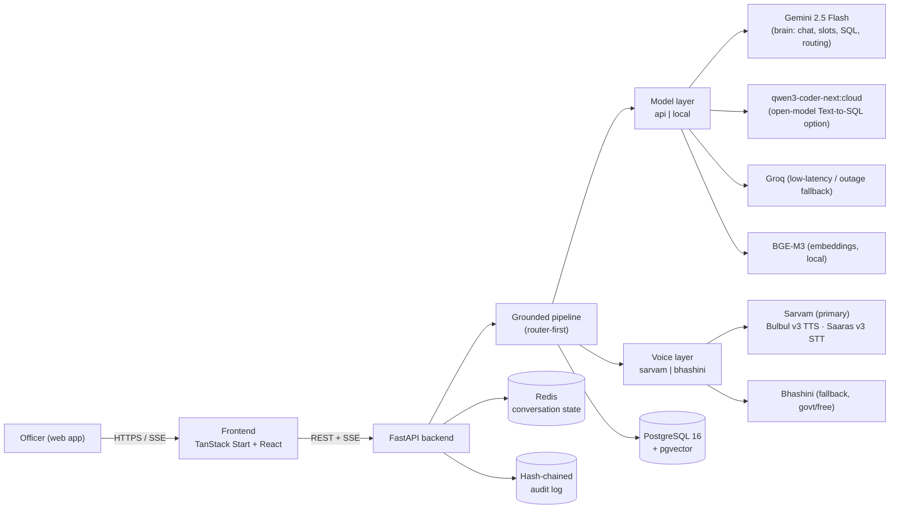

# Satyam — Architecture

Conversational AI over the Karnataka State Police crime database. Officers ask
questions in English or Kannada (typed or spoken); Satyam routes the request,
grounds every answer in the database, and renders maps, link charts, and reports
— with role-based masking and a tamper-evident audit trail.

> **Build philosophy (decided):** ship the **API/cloud lane first** for a full
> working hackathon demo, and treat **heavy local/on-prem models as a later
> fallback** path. The production goal is an **India-made, on-prem, sovereign**
> stack — sequenced as an explicit Phase 2, not a day-one requirement.

## 1. High-level

## 2. Request lifecycle (chat)

1. **Auth** — bearer JWT decoded into a `Principal` (id, role, jurisdiction, clearance).
2. **RLS context** — the request session sets `satyam.role/jurisdiction_id/clearance`
   GUCs, so Postgres row-level security filters every subsequent query.
3. **Guardrails** — input is screened for injection / out-of-scope.
4. **Router** — Gemini (JSON-schema) classifies intent + extracts slots; a
   keyword fallback keeps routing alive in demo mode.
5. **Tool execution** by lane:
   - `sql_query` → Text-to-SQL → **sqlglot guard** (SELECT-only, table allow-list,
     forced LIMIT) → execute under RLS.
   - `narrative_search` → BGE-M3 embed → pgvector ANN → rerank.
   - `hotspot` → grouped geo-aggregation.
   - `network` → NetworkX ego graph.
   - `report` → structured report payload.
6. **Compose** — a grounded, cited answer is generated (Groq fallback on primary
   failure) and streamed token-by-token over SSE.
7. **Voice (optional)** — for spoken interaction, input audio → STT and the
   composed answer → TTS via the **voice layer** (Sarvam primary, Bhashini
   fallback). Scripted demo answers are pre-cached as audio.
8. **Mask** — PII is masked server-side before leaving the API if the caller
   lacks clearance.
9. **Audit** — the query is appended to the hash-chained log.

## 3. Defense in depth

| Threat | Control |
|--------|---------|
| Bad/over-broad Text-to-SQL (R6) | sqlglot allow-list + LIMIT, SELECT-only, never trust the model string |
| Cross-jurisdiction / over-clearance reads | Postgres RLS on every lane + app-side ABAC |
| PII leakage to under-cleared users | server-side masking before serialization |
| Tampered history | hash-chained audit, single-pass verification |
| Model safety blocks (always-on child-safety) | catch `blockReason` → templated DB fallback / Groq open-model lane |
| Prompt injection | input precheck guardrail |
| Latency / outage (R2) | Groq low-latency fallback lane, bounded context window |
| Voice provider outage / credit exhaustion | Bhashini fallback (free, govt) + pre-cached demo TTS |

## 4. Model & API strategy

The active build is the **API/cloud lane**. Heavy local models are **parked as a
future on-prem fallback** (Phase 2), not built now. `MODEL_BACKEND=api|local`
and `VOICE_BACKEND=sarvam|bhashini` switch lanes with the same application code.

### 4.1 Active lanes (build now — demo)

| Job | Service | Notes |
|-----|---------|-------|
| Chat & phrasing | **Gemini 2.5 Flash** | The "brain"; Groq as low-latency / outage fallback |
| Understanding / slots | **Gemini 2.5 Flash** | Same model, different prompt |
| Intent routing | **Gemini 2.5 Flash** | JSON-schema; keyword fallback in demo |
| Text-to-SQL (primary) | **Gemini 2.5 Flash** | Best accuracy, free tier |
| Text-to-SQL (open-model option) | **`qwen3-coder-next:cloud`** (Ollama Cloud) | 80B total / 3B active, fast, tool-calling, 256K ctx; free-tier light usage |
| Low-latency / outage fallback | **Groq** | Fast open-model lane + sensitive-narrative rephrasing |
| Embeddings (RAG) | **BGE-M3** (local) | Sole embedder; query + doc share one space, so it stays local (not swappable for an API without re-embedding) |
| Kannada / English voice | **Sarvam** (free tier) — primary | Bulbul v3 (TTS), Saaras v3 (STT), Sarvam Translate (MT) |
| Voice fallback | **Bhashini** (govt) | Free, Indian, no credit cap → keeps voice up if Sarvam fails or credits run out |

> **Sarvam free-tier note:** signup credits are a **one-time grant** (they do
> **not** auto-renew weekly); they never expire but are not replenished, after
> which it is pay-per-use (Bulbul v3 TTS ~₹30/10K chars, STT ~₹30/hr,
> Translate ~₹20/10K chars). Demo volume is tiny, but **pre-cache scripted demo
> TTS** to conserve credits and remove on-stage latency. **Ollama Cloud free
> tier** is "light usage" with 5-hour session + weekly resets and 1 concurrent
> model — consider Pro ($20/mo) or pre-caching for demo-day safety.

### 4.2 Parked as future fallback (Phase 2 — on-prem)

`MODEL_BACKEND=local` heavy models, added later for the sovereign deployment:
Qwen2.5-Coder-7B / Qwen3-Coder-30B (or `qwen3-coder:30b`) · Llama 3.1-8B ·
IndicTrans2 · AI4Bharat IndicConformer · faster-whisper · Indic-Parler-TTS ·
bge-reranker-v2-m3.

## 5. Two-phase rollout (demo → sovereign)

| Layer | Phase 1 — Hackathon demo | Phase 2 — "Indian-made only" production |
|-------|--------------------------|----------------------------------------|
| Brain / chat / slots | Gemini 2.5 Flash | Sarvam-M / Sarvam 30B (Indian LLM) |
| Text-to-SQL | Gemini 2.5 Flash + `qwen3-coder-next:cloud` | Local Qwen-Coder (on-prem) |
| Kannada voice / translate | Sarvam (primary) → Bhashini (fallback) | Bhashini (govt) + Sarvam (Indian) |
| Embeddings | BGE-M3 (local) | BGE-M3 (local) |
| Hosting | External cloud OK (synthetic data, no real PII) | Fully on-prem / India-hosted, behind the firewall |

**Sovereignty note:** external clouds (Gemini, Ollama Cloud, Sarvam) are
acceptable for the demo because it uses **synthetic FIR data only**. For live
KSP data, every component swaps to the on-prem, India-hosted lane — nothing
leaves the building.

## 6. Data model (frozen day one — R8)

`cases` · `persons` · `case_persons` · `stations` · `officers` ·
`narratives(embedding vector(1024))`, plus `app_users` and `audit_log`.
See `backend/migrations/001_init.sql`.

## 7. Two-track demo honesty (R7)

- **Deployed link** — api lane + synthetic data (judge-accessible, low-cost).
- **Demo video** — local lane on a GPU (e.g. RTX 4070) showing on-prem
  inference. Both run the *same* code; only `MODEL_BACKEND` / `VOICE_BACKEND`
  differ.

## 8. Frontend

TanStack Start + React 19, shadcn/ui, Leaflet maps. Eight surfaces: Login,
Console (conversation + canvas), Map/Hotspot, Network, Case Drawer (masked),
Reports, Audit/Admin, and **Settings**. Talks to the backend via
`src/lib/api/client.ts` (REST + SSE `streamChat`). Configure `VITE_API_BASE_URL`.

### 8.1 Settings panel

A **Settings** button (gear icon) in the app opens a control panel that exposes
the runtime backend switches as UI controls, so the lanes can be flipped **live**
(e.g. on stage during the demo) without redeploying:

| Control | UI element | Maps to | Options |
|---------|-----------|---------|---------|
| Model backend | Enable/disable toggles | `MODEL_BACKEND` | **API model** (cloud) — on/off · **Local model** (on-prem) — on/off |
| Brain engine (chat / slots / routing) | Dropdown | `BRAIN_ENGINE` | **Gemini 2.5 Flash** (default) \| **Groq** (low-latency / outage fallback) |
| Text-to-SQL engine | Dropdown | SQL engine selector | **Gemini 2.5 Flash** (default) \| **qwen3-coder-next:cloud (Ollama Cloud)** |
| Voice backend | Dropdown | `VOICE_BACKEND` | **Sarvam** (primary) \| **Bhashini** (fallback) |

Behaviour:
- The **API model** and **Local model** rows are independent on/off toggles. The
  app prefers API when both are enabled, and uses whichever remains if one is
  disabled. Enabling **Local model** with no GPU available auto-falls back to API.
- The **Text-to-SQL dropdown** lets a presenter (or judge) pick the SQL engine
  on the fly; the **sqlglot guard + validate/repair loop apply identically** to
  both Gemini and qwen3-coder-next, so safety never depends on the choice.
- Selections persist in app state (optionally per user) and are sent to the
  backend with each request, overriding the server defaults for that session.

## 9. Configuration flags

| Flag | Values | Purpose |
|------|--------|---------|
| `MODEL_BACKEND` | `api` \| `local` | Switch brain/SQL between cloud APIs and on-prem models (exposed as enable/disable toggles in the Settings UI) |
| `BRAIN_ENGINE` | `gemini` \| `groq` | Select the brain engine for chat / slots / routing (exposed as a dropdown in the Settings UI) |
| `SQL_ENGINE` | `gemini` \| `qwen3-coder-next` | Select the Text-to-SQL engine (exposed as a dropdown in the Settings UI) |
| `VOICE_BACKEND` | `sarvam` \| `bhashini` | Switch voice between Sarvam (primary) and Bhashini (fallback) (exposed as a dropdown in the Settings UI) |
| `VITE_API_BASE_URL` | URL | Frontend → backend base URL |
