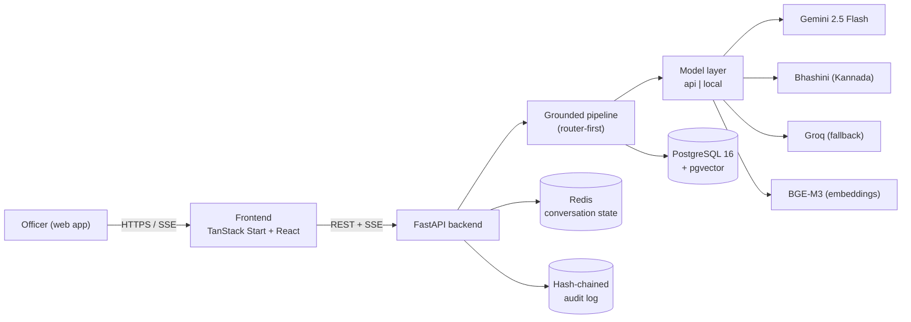

# Satyam — Architecture

Conversational AI over the Karnataka State Police crime database. Officers ask
questions in English or Kannada (typed or spoken); Satyam routes the request,
grounds every answer in the database, and renders maps, link charts, and reports
— with role-based masking and a tamper-evident audit trail.

## 1. High-level

## 2. Request lifecycle (chat)

1. **Auth** — bearer JWT decoded into a `Principal` (id, role, jurisdiction, clearance).
2. **RLS context** — the request session sets `satyam.role/jurisdiction_id/clearance`
   GUCs, so Postgres row-level security filters every subsequent query.
3. **Guardrails** — input is screened for injection / out-of-scope.
4. **Router** — Gemini (JSON-schema) classifies intent + extracts slots; a
   keyword fallback keeps routing alive in demo mode.
5. **Tool execution** by lane:
   - `sql_query` → Text-to-SQL → **sqlglot guard** (SELECT-only, table allow-list,
     forced LIMIT) → execute under RLS.
   - `narrative_search` → BGE-M3 embed → pgvector ANN → rerank.
   - `hotspot` → grouped geo-aggregation.
   - `network` → NetworkX ego graph.
   - `report` → structured report payload.
6. **Compose** — a grounded, cited answer is generated (Groq fallback on primary
   failure) and streamed token-by-token over SSE.
7. **Mask** — PII is masked server-side before leaving the API if the caller
   lacks clearance.
8. **Audit** — the query is appended to the hash-chained log.

## 3. Defense in depth

| Threat | Control |
|--------|---------|
| Bad/over-broad Text-to-SQL (R6) | sqlglot allow-list + LIMIT, SELECT-only, never trust the model string |
| Cross-jurisdiction / over-clearance reads | Postgres RLS on every lane + app-side ABAC |
| PII leakage to under-cleared users | server-side masking before serialization |
| Tampered history | hash-chained audit, single-pass verification |
| Model safety blocks (always-on child-safety) | catch `blockReason` → templated DB fallback / Groq open-model lane |
| Prompt injection | input precheck guardrail |
| Latency / outage (R2) | Groq low-latency fallback lane, bounded context window |

## 4. Model strategy (locked, 3 free lanes)

- **Gemini 2.5 Flash** — chat, Text-to-SQL, slot-filling, phrasing.
- **Bhashini** — Kannada STT / TTS / MT (primary Indic layer).
- **Groq** — low-latency / outage fallback and sensitive-narrative rephrasing.
- **BGE-M3** — sole embedder (local), no hosted fallback.
- Heavy/on-prem inference runs via `MODEL_BACKEND=local` (vLLM/Ollama etc.).
  Sarvam is intentionally excluded.

## 5. Data model (frozen day one — R8)

`cases` · `persons` · `case_persons` · `stations` · `officers` ·
`narratives(embedding vector(1024))`, plus `app_users` and `audit_log`.
See `backend/migrations/001_init.sql`.

## 6. Two-track demo honesty (R7)

- **Deployed link** — api lane + synthetic data (judge-accessible, low-cost).
- **Demo video** — local lane on a GPU (e.g. RTX 4070) showing full on-prem
  inference. Both run the *same* code; only `MODEL_BACKEND` differs.

## 7. Frontend

TanStack Start + React 19, shadcn/ui, Leaflet maps. Seven surfaces: Login,
Console (conversation + canvas), Map/Hotspot, Network, Case Drawer (masked),
Reports, Audit/Admin. Talks to the backend via `src/lib/api/client.ts` (REST +
SSE `streamChat`). Configure `VITE_API_BASE_URL`.
