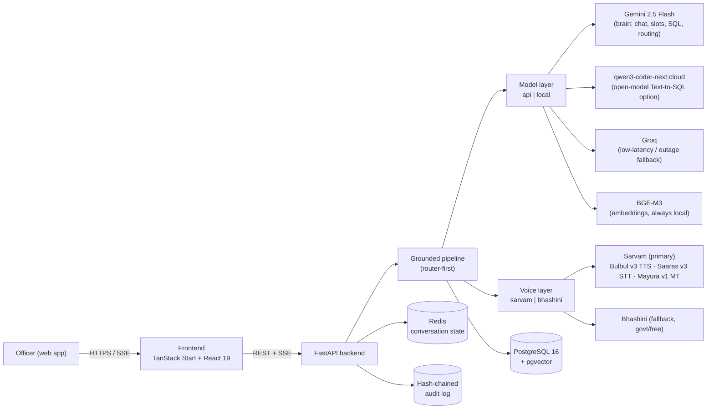

# Satyam — Architecture

Bilingual (English + Kannada), voice-enabled conversational AI for police crime
intelligence. Built for **Datathon 2026 — KSP × hack2skill**. Officers ask
questions in natural language (typed or spoken); Satyam routes the intent,
grounds every answer in the PostgreSQL database, and renders maps, link-graphs,
trend charts, and reports — with role-based masking and a tamper-evident audit
trail.

> **Build philosophy:** ship the **API/cloud lane first** for a full working
> hackathon demo. Heavy local/on-prem models are an explicit **Phase 2**
> (sovereign deployment), not a day-one requirement.

---

## 1. High-level



---

## 2. Request lifecycle (chat)

1. **Auth** — bearer JWT decoded into a `Principal` (rank, scope, district,
   range, station_id, clearance L1–L4, officer_id).
2. **RLS context** — `app.*` GUCs are set on the session
   (`app.scope`, `app.range`, `app.district`, `app.station_id`, `app.clearance`)
   so `fn_scope_ok()` gates every Postgres query automatically.
3. **Guardrails** — input screened for injection / out-of-scope content.
4. **Router** — Gemini classifies intent + extracts slots via JSON-schema; a
   keyword fallback keeps routing live in demo mode. Markdown fences are stripped
   before JSON parsing (`_strip_markdown_fences()`).
5. **Tool execution** by lane:
   - `sql_query` → Text-to-SQL → **sqlglot guard** (SELECT-only, table
     allow-list, forced LIMIT 200) → execute under RLS.
   - `narrative_search` → BGE-M3 embed → pgvector ANN → bge-reranker-v2-m3.
   - `hotspot` → grouped geo-aggregation.
   - `network` → NetworkX ego-graph.
   - `report` → structured report payload.
   - **Intelligence lanes** (PS2–PS8): forecast, trends/MO clustering,
     socio-economic dashboard, similar-case RAG, offender profile, case
     timeline, ring detection.
6. **Compose** — a grounded, cited answer streamed token-by-token over SSE.
   Groq fallback on primary failure.
7. **Voice (optional)** — Sarvam Saaras v3 STT (input) → pipeline →
   Sarvam Bulbul v3 TTS (output). Auto-detects English vs Kannada. Bhashini
   as fallback. Language also drives the UI toggle (`lang: "en" | "kn"`).
8. **Mask** — PII masked server-side (4-tier L1–L4) before leaving the API.
9. **Audit** — query appended to the SHA-256 hash-chained log.

---

## 3. Defense in depth

| Threat | Control |
|--------|---------|
| Bad/over-broad Text-to-SQL | sqlglot allow-list + forced LIMIT, SELECT-only, model output never trusted directly |
| Cross-jurisdiction / over-clearance reads | Postgres RLS `fn_scope_ok()` on every lane + app-side ABAC (`require(principal, Permission)`) |
| PII leakage to under-cleared users | 4-tier server-side masking (`core/masking.py`) before serialisation |
| Tampered history | SHA-256 hash-chain; single-pass verification endpoint |
| Model safety blocks | catch `blockReason` → templated DB fallback / Groq open-model lane |
| Prompt injection | input pre-check guardrail (`pipeline/guardrails.py`) |
| Markdown fences in LLM JSON output | `_strip_markdown_fences()` in `text_to_sql.py` + `router.py` + explicit "no fences" in `prompts.py` |
| Latency / outage | Groq low-latency fallback; bounded context window |
| Voice provider outage / credit exhaustion | Bhashini fallback (free, govt) + pre-cached demo TTS |

---

## 4. Model & API strategy

### 4.1 Active lanes (demo build)

| Job | Service | Notes |
|-----|---------|-------|
| Chat, phrasing, slots | **Gemini 2.5 Flash** | Brain; Groq as low-latency/outage fallback |
| Intent routing | **Gemini 2.5 Flash** | JSON-schema; keyword fallback in demo |
| Text-to-SQL (primary) | **Gemini 2.5 Flash** | Best accuracy; free tier |
| Text-to-SQL (open-model) | **`qwen3-coder-next:cloud`** (Ollama Cloud) | 80B total / 3B active, 256K ctx, tool-calling |
| Embeddings (RAG) | **BGE-M3** (local, FP16 on GPU) | Sole embedder — dim 1024; never swappable for a hosted API without re-embedding the narratives table (~568M params, ~1.3 GB FP16). Runs on RTX 4070 8 GB. |
| Reranking (RAG) | **bge-reranker-v2-m3** (local, FP16 on GPU) | ~568M params, ~1.1 GB FP16; ~2.4 GB weights combined, ~4–5 GB peak VRAM |
| Kannada / English voice | **Sarvam** (primary) — Bulbul v3 TTS · Saaras v3 STT · Mayura v1 MT | Free-tier one-time grant; pre-cache scripted demo TTS |
| Voice fallback | **Bhashini** (govt) | Free, no credit cap |

### 4.2 Parked for Phase 2 (on-prem sovereign)

`MODEL_BACKEND=local` heavy models added later:
Sarvam-M / Sarvam 30B · Qwen2.5-Coder-7B / Qwen3-Coder-30B · Llama 3.1-8B ·
IndicTrans2 · AI4Bharat IndicConformer · faster-whisper · Indic-Parler-TTS.

---

## 5. Data model

### 5.1 Core tables (`backend/migrations/002_schema_v2.sql`)

| Table | PK | Key columns |
|-------|----|-------------|
| `stations` | `station_id INT` | `station_name`, `district`, `"range"` |
| `officers` | `officer_id INT` | `name`, `rank`, `station_id FK` |
| `users` | `user_id SERIAL` | `username`, `password_hash`, `assigned_rank FK` |
| `rank_access` | `rank TEXT` | `scope_level`, `clearance`, `gazetted` (14 KSP ranks) |
| `cases` | `case_id INT` | `fir_number`, `fir_year`, `crime_type`, `crime_category`, `legal_code`, `fir_type`, `status`, `district`, `station_name`, `report_date`, `incident_date`, `sections`, `motive`, `complaint_mode`, `latitude`, `longitude` |
| `persons` | `person_id INT` | `name`, `gender`, `age`, `address`, `risk_score` |
| `case_persons` | `(case_id, person_id, role)` | role CHECK: Accused/Victim/Complainant/Witness/Arrested/IO |
| `narratives` | `narrative_id INT` | `case_id FK`, `language` (en/kn), `body`, `body_tsv` tsvector, `embedding vector(1024)` |
| `audit_log` | `audit_id SERIAL` | `at`, `user_id`, `action`, `query`, `result`, `src`, `row_hash` (SHA-256 chain) |

### 5.2 PS4/PS7 extension tables

| Table | Purpose |
|-------|---------|
| `district_socio_economic_indicators` | literacy rate, urbanisation %, income index per district — used by Socio Dashboard |
| `financial_accounts` | synthetic bank/wallet accounts linked to persons |
| `financial_transactions` | synthetic transactions between accounts |

### 5.3 Views & functions

| Object | Purpose |
|--------|---------|
| `v_officer_session` | Resolves effective rank/scope/clearance for a logged-in user |
| `fn_scope_ok(case_row)` | RLS gate: checks `app.*` GUCs against case's station/district/range |

### 5.4 Row counts (60 % cloud / 100 % local)

| Table | Neon (cloud 60 %) | Local PG17 (100 %) |
|-------|-------------------|--------------------|
| stations | 1,074 | 1,074 |
| officers | 6,949 | 6,949 |
| cases | ~60,000 | 100,000 |
| persons | ~249,970 | 416,616 |
| case_persons | ~249,970 | 416,616 |
| narratives | ~120,000 | 200,000 |

Neon free tier is at ~192 MB (512 MB cap). Financial tables pushed to local only.

---

## 6. Backend layout

```
backend/
  app/
    api/
      deps.py                  # get_principal(), get_scoped_session()
      routes/
        auth.py                # JWT login (14 KSP ranks), demo mode
        chat.py                # SSE /chat stream
        cases.py               # GET /cases, GET /cases/{id}?lang=
        map.py                 # hotspots, station breakdown, offender trail
        network.py             # ego-graph, ring detection
        intelligence.py        # PS2–PS8 endpoints
        reports.py             # report assembly
        audit.py               # hash-chain log read
        voice.py               # STT, TTS, translate
        settings.py            # engine override introspection
        health.py              # /health/models
    core/
      rbac.py                  # 14 KSP ranks, L1–L4 clearance, PROTECTED_CRIMES
      masking.py               # 4-tier PII masking
      audit.py                 # SHA-256 hash-chain append + verify
      security.py              # JWT encode/decode
    db/
      models.py                # SQLAlchemy ORM (v2 schema)
      rls.py                   # apply_rls_context() — sets app.* GUCs
      session.py               # async engine + session factory
    models/
      base.py                  # BaseLLM, BaseSTT, BaseTTS, BaseTranslator
      registry.py              # get_llm(), get_sql_llm(), get_stt(), get_tts(), get_translator()
      api/
        gemini.py              # Gemini 2.5 Flash (brain + SQL)
        groq.py                # Groq (low-latency fallback)
        sarvam.py              # Bulbul v3 TTS, Saaras v3 STT, Mayura v1 MT
        bhashini.py            # Bhashini STT/TTS fallback
        ollama_cloud.py        # qwen3-coder-next:cloud (SQL option)
        google_voice.py        # Google Cloud TTS (aux)
      local/
        embedder_bge.py        # BGE-M3 FP16 (always active)
        reranker_bge.py        # bge-reranker-v2-m3 FP16
        llm_local.py           # Phase-2 stub
        stt_whisper.py         # Phase-2 stub
        tts_parler.py          # Phase-2 stub
    pipeline/
      router.py                # Gemini intent classifier + keyword fallback
      slots.py                 # slot extraction
      guardrails.py            # input safety pre-check
      orchestrator.py          # fan-out to tools, compose, stream
      prompts.py               # system prompts (SQL_SYSTEM, COMPOSE_SYSTEM)
      tools/
        text_to_sql.py         # LLM → SQL; _strip_markdown_fences(); _mask_rows()
        sql_guard.py           # sqlglot allow-list + LIMIT + SELECT-only
        rag.py                 # BGE-M3 embed → pgvector → rerank
        analytics.py           # hotspot, ego_network, station_breakdown
    schemas/
      auth.py chat.py case.py intelligence.py map.py network.py report.py voice.py
    services/
      case_service.py          # get_case(lang=), list_cases()
      chat_service.py          # stream_chat() — orchestrator entry point
      intelligence_service.py  # PS2–PS8 data queries
      map_service.py           # hotspot geo-aggregation
      network_service.py       # ego-graph, ring membership
      report_service.py        # report assembly
    config.py                  # Pydantic Settings (all env vars)
    main.py                    # FastAPI app factory, CORS, router mounts
    logging_config.py          # structlog JSON config
  migrations/
    002_schema_v2.sql          # canonical schema + RLS + GRANTS
    teardown.sql               # idempotent DROP of all objects
  seed/
    load_seed.py               # asyncpg COPY bulk-loader
    embed_narratives.py        # BGE-M3 embedding job (resumable)
    load_seed.sql              # psql COPY script
```

---

## 7. Frontend layout

```
frontend/src/
  routes/
    __root.tsx                 # layout shell, Noto Sans Kannada font
    index.tsx                  # landing / hero page (background video)
    login.tsx                  # demo login — 14 KSP ranks
    console.tsx                # conversational AI + results canvas (PS1)
    network.tsx                # ego/ring graph explorer (PS2)
    forecast.tsx               # early warning & predictive grid (PS8)
    trends.tsx                 # trend bars + MO clusters (PS3)
    socio.tsx                  # socio-economic dashboard (PS4)
    profile.$personId.tsx      # offender profile + timeline (PS5)
    reports.tsx                # report cart + PDF export
    audit.tsx                  # tamper-evident audit log
    transcripts.tsx            # voice transcript store
    about.tsx                  # project info
  components/
    Shell.tsx                  # global nav + voice-command router
    CaseDrawer.tsx             # sliding case detail (summary/persons/similar/timeline/map tabs)
    CrimeMap.tsx               # Leaflet heat/pin/grid map
    ThemePicker.tsx            # 6 professional colour themes + legacy themes
    SettingsDialog.tsx         # live engine overrides (brain/SQL/voice)
    ProfileMenu.tsx            # user profile + logout
    AccountManager.tsx         # account creation
    CreateAccountDialog.tsx    # account creation modal
    DarkModeToggle.tsx         # dark/light toggle
    LandingShell.tsx           # landing page shell
  lib/
    i18n.tsx                   # custom i18n: I18nProvider, useI18n(), useT(), DICT (EN→KN, 200+ keys)
    tData.ts                   # tData(field, value, lang) — categorical DB value lookup (kn-data.json)
    api/
      client.ts                # typed REST + SSE streamChat(); all auth headers
      intelligence.ts          # PS2–PS8 typed API wrappers
  locales/
    kn-data.json               # Kannada lookup dict: crime_type, status, district (all 41), role, gender, motive, …
    en.json                    # reference copy (not loaded by app)
  lib/voice/
    tts.ts                     # speakViaSarvam() — Sarvam/Web Speech TTS
    recorder.ts                # MediaRecorder-based STT capture
    lang.ts                    # detectLang(), resolveLang() — auto EN/KN
  styles.css                   # Tailwind + CSS custom properties; 6 [data-theme] professional themes; html[lang=kn] Noto Sans Kannada rule
```

---

## 8. Bilingual support (English + Kannada)

### 8.1 Static UI strings — custom i18n

The app uses a **custom i18n system** (`src/lib/i18n.tsx`), **not** react-i18next:

- `I18nProvider` wraps the app; stores `lang: "EN" | "KN"` in React context.
- `useI18n()` → `{ lang, setLang, t }` · `useT()` → `t`
- `t("string")` looks up the `DICT` (200+ EN→KN entries); falls back to English.
- Language persisted to `localStorage["fq-lang"]`.
- Toggle in `Shell.tsx`: sets `lang`, persists to localStorage, sets
  `document.documentElement.lang = "kn" | "en"` (drives CSS font rule).
- `html[lang="kn"]` in `styles.css` applies **Noto Sans Kannada** globally.

### 8.2 Categorical DB values — `tData()`

Fixed-vocabulary DB fields are translated via `src/lib/tData.ts`:

```ts
tData("crime_type", row.crime_type, lang)  // → "ಕಳ್ಳತನ"
tData("status",     row.status,     lang)  // → "ತೆರೆದಿದೆ"
tData("district",   row.district,   lang)  // → "ಬೆಂಗಳೂರು ನಗರ"
```

Dictionary in `src/locales/kn-data.json` covers:
`crime_type` (40+ values), `status`, `fir_type`, `crime_category`, `motive`,
`complaint_mode`, `role`, `gender`, `district` (all 41 Karnataka districts +
special units), `legal_code`, `risk_label`, `kyc_risk_level`.

Applied in: `CaseDrawer`, `console`, `forecast`, `trends`, `profile`, `socio`.

### 8.3 Case narratives — language-aware fetch

`GET /cases/{id}?lang=kn` — backend prefers the `language="kn"` narrative row,
falls back to `language="en"` if none exists. `CaseDrawer` passes current UI
`lang` to `api.caseById(id, lang)`.

### 8.4 Voice

Auto-detect English vs Kannada from the user's text (`detectLang()`).
Sarvam Saaras v3 STT handles both languages. `resolveLang()` drives TTS
language so spoken answers match the screen language. Language toggle also
updates the voice lane.

---

## 9. RBAC / ABAC

14 KSP ranks mapped to 4 scope levels and 4 clearance levels:

| Rank | Scope | Clearance |
|------|-------|-----------|
| DGP, IGP | state | L4 |
| DIG | range | L4 |
| SP, DySP | district | L3–L4 |
| CI/PI, PSI/SI, ASI | station | L2–L3 |
| HC, PC | station | L1 |

- **RLS** (`fn_scope_ok()`) gates every DB query to the officer's
  station/district/range/state scope.
- **ABAC** (`require(principal, Permission)`) checks permissions in each route.
- **Masking** (`core/masking.py`) applies 4-tier PII masking before
  serialisation:
  - L1: all names masked, coords coarsened, PROTECTED narratives hidden.
  - L2: person PII + place masked, PROTECTED narratives redacted.
  - L3: only victim/complainant on PROTECTED crimes.
  - L4: full access.
- `PROTECTED_CRIMES` frozenset: POCSO, RAPE, DOWRY DEATHS, SC/ST, etc.

---

## 10. Intelligence features (PS2–PS8)

All served from `backend/app/api/routes/intelligence.py` /
`backend/app/services/intelligence_service.py`:

| PS | Screen | Endpoint(s) |
|----|--------|-------------|
| PS1 | Console (RAG + SQL + maps) | `/chat` (SSE), `/map/hotspots`, `/map/station-breakdown` |
| PS2 | Network graph | `/network/rings`, `/network/case/{id}`, `/network/person/{id}` |
| PS3 | Trends & Patterns | `/trends`, `/trends/seasonal`, `/mo/clusters` |
| PS4 | Socio Dashboard | `/socio/demographics`, `/socio/correlation`, `/socio/risk-index` |
| PS5 | Offender Profile | `/persons/{id}/profile`, `/persons/{id}/timeline` |
| PS6 | Similar Cases + Timeline | `/cases/{id}/similar`, `/cases/{id}/timeline` |
| PS7 | Financial Intel | financial_accounts, financial_transactions tables |
| PS8 | Early Warning | `/forecast/hotspots`, `/forecast/alerts`, `/forecast/backtest` |

---

## 11. Colour themes

`ThemePicker.tsx` + `styles.css` provide **6 professional themes** (each with
light and dark variants) set via `data-theme` attribute on `<html>`:

| Theme | Key colour |
|-------|-----------|
| Slate | Blue-grey |
| Indigo | Deep indigo |
| Forest | Green |
| Graphite | Dark neutral |
| Midnight | Navy |
| Pine | Teal-green |

Plus 8 legacy themes via inline CSS variable overrides.

---

## 12. Configuration flags

| Flag | Values | Purpose |
|------|--------|---------|
| `DATABASE_URL` | `postgresql+asyncpg://…` | Primary DB (Neon cloud or local PG17) |
| `REDIS_URL` | `redis://…` | Conversation state cache |
| `JWT_SECRET` | string | Token signing |
| `MODEL_BACKEND` | `api` \| `local` | Switch brain/SQL lanes |
| `BRAIN_ENGINE` | `gemini` \| `groq` | Brain engine (chat/slots/routing) |
| `SQL_ENGINE` | `gemini` \| `qwen3-coder-next` | Text-to-SQL engine |
| `VOICE_BACKEND` | `sarvam` \| `bhashini` | Voice provider |
| `GEMINI_API_KEY` | string | Gemini 2.5 Flash |
| `GROQ_API_KEY` | string | Groq fallback |
| `SARVAM_API_KEY` | string | Sarvam TTS/STT/MT |
| `BHASHINI_*` | strings | Bhashini API credentials |
| `OLLAMA_CLOUD_URL` / `_API_KEY` / `_SQL_MODEL` | strings | Ollama Cloud qwen3 |
| `VITE_API_BASE_URL` | URL | Frontend → backend |

All flags live in `.env` (root) / `backend/.env`. Never committed.

---

## 13. Two-phase rollout

| Layer | Phase 1 — Hackathon demo | Phase 2 — Sovereign on-prem |
|-------|--------------------------|------------------------------|
| Brain / chat / slots | Gemini 2.5 Flash | Sarvam-M / Sarvam 30B |
| Text-to-SQL | Gemini 2.5 Flash + qwen3-coder-next | Local Qwen-Coder (on-prem) |
| Voice / translate | Sarvam → Bhashini fallback | Bhashini + Sarvam (Indian) |
| Embeddings + rerank | BGE-M3 + bge-reranker (local GPU) | BGE-M3 + bge-reranker (local) |
| Hosting | External cloud OK (synthetic data) | Fully on-prem / India-hosted |

**Sovereignty note:** external clouds are used only with **synthetic FIR data**.
For live KSP data every component swaps to the on-prem India-hosted lane — no
real data leaves the building.
